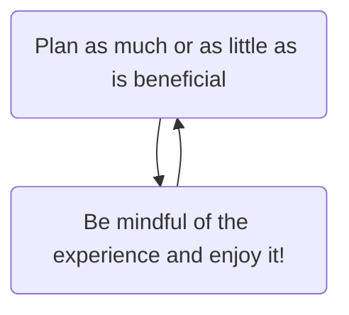

# 1. Why
---
## typora-copy-images-to: ./img
[TOC]
# Why Be Productive?

> “Do not squander time, for that’s the stuff life’s made of.”
> – Benjamin Franklin
Ultimately, managing our time is a means to an end. And that end is the living of life. How we spend our time is, quite literally, how we are living our life.

Productivity in itself serves no purpose. In some sense, it's a hobby, a meta-skill, a tool; it isn't inherently meaningful in itself.

That doesn't mean it isn't useful; just like a hammer can be used to build a home, productivity derives meaning from whichever purpose you're using it to fulfill.

motivation-mt-everest-780x439

> One of the sneakier pitfalls of an efficiency-based attitude to time is that we start to feel pressured to use our leisure time “productively”, too – an attitude which implies that enjoying leisure for its own sake, which you might have assumed was the whole point of leisure, is somehow not quite enough. And so we find ourselves, for example, travelling to unfamiliar places not for the sheer experience of travel, but in order to add to our mental storehouse of experiences, or to our Instagram feeds. We go walking or running to improve our health, not for the pleasure of movement; we approach the tasks of parenthood with a fixation on the successful future adults we hope to create.
> – [Oliver Burkeman](https://www.theguardian.com/technology/2016/dec/22/why-time-management-is-ruining-our-lives)
Perhaps planning and time-management is most useful in bursts, then to be put away. This means that we can reap the benefits of having a plan and being capable of being reminded and making decisions far into the future, while letting go of time management when we are experiencing life.

For example, it is useful to have a general plan of a vacation. It helps equalise expectations and to go somewhere that will satisfy all parties. However, being focused on seeing as much as possible rather than enjoyment for enjoyment's sake can strip away excitement and cause anxiety about missing out.

Instead, plan in bursts:

Staying in the top box has a tendency to undermine the bottom one.

<!-- #Life -->

<!-- {BearID:7887A97D-DF98-4F56-A2E6-F5A0B096E28F-15756-00001303275E910C} -->
