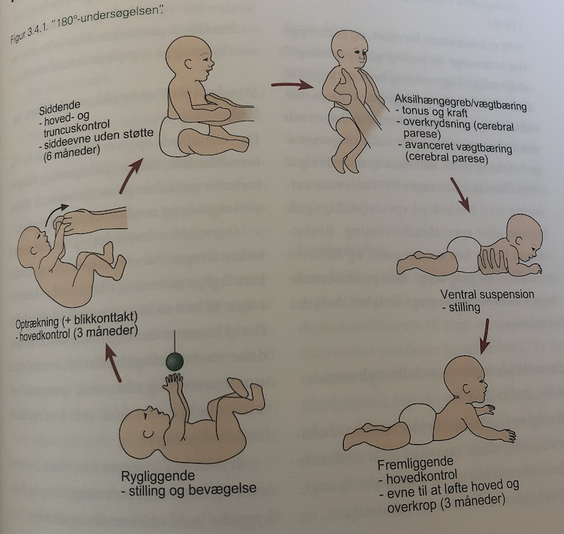

# 180-graders undersøgelsen

Q. Du laver 180-graders undersøgelse på et barn. Hvornår skal barnet kunne løfte hoved og overkrop, når det ligger på maven?
A. 3 måneder

Q. Du laver 180-graders undersøgelse på et barn. Hvornår skal barnet have hovedkontrol, når det trækkes op fra ryggen?
A. 3 måneder

Q. Du laver 180-graders undersøgelse på et barn. Hvornår skal barnet kunne sidde uden støtte?
A. 6 måneder

## Backlinks
* [[Børneundersøgelse]]
	* [[180-graders undersøgelsen]]
[[5-månedersundersøgelsen]]
[[12-månedersundersøgelsen]]
[[2-årsundersøgelsen]]
[[3-årsundersøgelsen]]
[[4-årsundersøgelsen]]
[[5-årsundersøgelsen]]

<!-- #anki/tag/med/Pediatrics #anki/deck/Medicine #anki/tag/med/GP -->

<!-- {BearID:F63F7745-623A-45E6-960E-F34F7E897538-76574-00009770AA680AB4} -->
