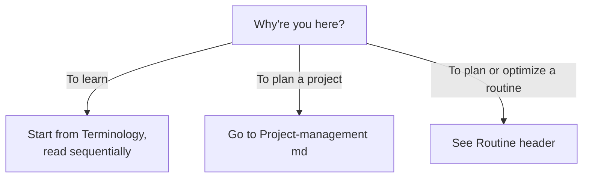
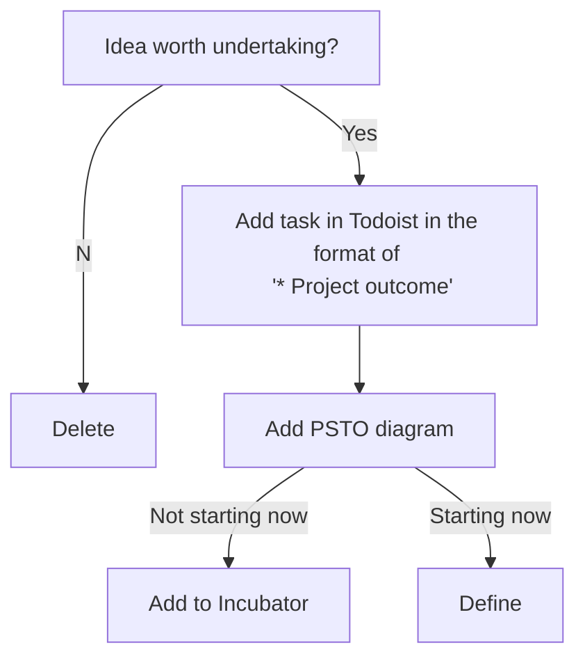

# 2. How – From Purpose to Projects

# Terminology – How to Think

## Religio (Purpose)
/Synonyms: *PHILOSOPHY, DOCTRINE, MORAL SENTIMENT, RELIGION, RELIGIO*/

This is why you do things. For me in 2018, my religio is strongly Mahayana-buddhism inspired. I wish to love strongly and to use this as motivation to ease suffering and increase joy, both my own, that of those around me and every being on earth. I believe most or all of my other values are derivatives of this.

## Strategy
This is how you accomplish your religio, but in an over-arching sense. As an example, becoming a doctor to ease suffering. However, becoming a doctor eases suffering in many ways, eg:

* Communicating well to patients, decreasing uncertainty
* Making accurate diagnoses quickly, decreasing uncertainty and time to relevant treatment
* Spending income on things that ease suffering
* Providing meaning to the doctor himself, making his life feel worthwhile.

## Tactics
Tactics is what to do, how you accomplish the strategic goals. To get good at diagnostics, you must:

1. Cultivate wide knowledge on diseases
2. Train to avoid cognitive biases
3. Improve the specificity of the questions you ask

Some tactics are more important as others; just like a person crawling is faster than him doing dog paddling, so some ways of contributing to a strategy are more effective than others.

## Operations
Operations is how you make tactics happen over time. Eg., to cultivate wide knowledge on diseases you must:

1. Constantly maintain your knowledge. A good way of doing this is Anki flashcards. To ensure those happen, you've habitified them and added them to Todoist. This ensures that this sub-tactic gets done, and is thus operations.
2. Expand your knowledge by reading up on diseases. A way of making this operational post-graduation would be to read up on diseases you encounter in the clinic where you have insufficient information to make a decision. To ensure you read up on them, add the disease to Todoist with a name, what information you need (eg. clinical presentation, complications, how to diagnose) and a priority.

When it comes to complicated topics like genetics or nuclear engineering, we all tend to realize right away that we don’t fully understand the topic, and tend to respect the difficulty of the domain. But, because the majority of operations are a set of simple elements, it’s easy to underestimate the difficulty of coordinating them all successfully at the same time. We all need to take this seriously to make the world better as quickly as possible.

Now, if you agree with this, how do you get good at operations?

## My PSTO
To keep my PSTO in memory, I'll add my current running strategies to an Anki flashcard. Purpose is short enough to not need to go there, tactics are the projects I'm running, operations is how I make them happen. So, strategies are the connector that's missing, the big but not huge picture.

# What – How to Get it Done

## Planning – Putting it Into Action

#### Recipe

Reverse PSTO (purpose, strategy, tactics and operations) diagram like so: (Clarifying projects -> Evaluating projects more clearly -> Picking the most effective projects first -> Being more effective -> Easing suffering).

#### Defining projects
Done weekly, see weekly planning folder.

#### Clarifying what's required
As a minimum, you should know:

1. What needs to be done
2. How will it get done
3. How much time will it take
4. Who will do it

But, this is a minimum. For succesful operations, you need to know /everything relevant to the specific project/.

Any goal that requires an hour or more of work should be noted as a project.

##### 1. What needs to get done
Read the requirements if they're external; define them if not. Defining requirements serves two purposes:

1. It forces you to be clear on why you're doing what you're doing
2. It sets a stopping-point, allowing you to measure whether you're on time or not

It's surprisingly common for people to work on something without defining how "good" it should be, which makes work difficult to complete.

##### 2. How will it get done

##### 3. How much time will it take
People mostly underestimate how many cycles they need. That’s because a lot more things can go wrong than can go right. What you want to accomplish for a work cycle session should be a short-term goal. It’s done when this small part is done. Focus on accomplishment, not doing work. Making a estimate for the number of cycles helps you not fall behind schedule, because you realize after each cycle if you behind time. This is especially important if the result is subjective and not concrete. Subjective results can take as long as you want, so setting a quality target beforehand is helpful.

##### 4. Who will do it

#### When to use sub-projects
If a project contains multiple outcomes that need to happen sequentially, define them as sub-projects. Otherwise, keep them separate. No advantage in making them hierarchial.

#### Planning
Keep projects no more abstract than at "tactics" level. They should be completable and concrete. Second, track project start and end dates, total days and working days.

Projects are separated based on their approximate duration into:

1. L-projects, > 50 hours
2. M-projects, 10 to 50 hours
3. S-projects, 2 hours to 10 hours

For the specific routines, see Alfred snippets

## Doing - Getting it done

## Which Projects Matter?
For more on this, see [/The Goal/](https://www.goodreads.com/book/show/113934.The_Goal?from_search=true) by Eliyahu M. Goldratt.

Good projects are project that:

1. Increase throughput
2. Decrease inventory
3. Decrease operational expenses

In one of the categories that matter to me.

### Throughput
The results that I'm achieving. Differ from each goal. Eg. higher relationship ratings for love, higher impact factor and more donations for purpose etc.

Increases if the slowest link in a value chain is improved upon.

### Inventory
Thinks I store that drag me down. Eg:

1. Projects that I'll probably never get to
2. Books I'll probably never read
3. Items I rarely use

For each of these, ask: Is this important? Is it necessary?

### Operational expenses
Operational expense is anything that turns inventory into throughout. This means that my operational expenses are time, energy and money. Things I can throw at a project to create results.

Any project that decreases temporal or monetary expenses can be useful.

### Project classes

#### Media
Whether media is in the positive or the negative differs. Most of it is distraction, and as such has low throughput, no inventory and decent operational expenses.

Be aware that books and TV-series especially often carry heavy operational expenses.

However, some books allow me to dramatically increase throughput; eg. /The Goal/ or some parts of The Strategic Review.

Others allow me to decrease operational expenses, especially "Background ops" by TSR.

Each piece of media should be evaluated on its own and, if it's long, periodically. See "Media.md" for how this is operationalised.

## Training in Operations
It seems like operations consist of two things; operations /classes/ and operation /specifics/.

#### Operation dimensions
Help you across domains. Examples of dimensions are:

1. Sequence – a sequential to-do list (Todoist)
2. Time – a calendar (iCal)
3. Time+sequence – a Gantt diagram (OmniPlan)
4. Multiple people/resources – schedules (?)
5. Motivation – feedback systems (work cycles)

For each of these dimensions, there's typically a best practice in place for management. It is *critical* to learn the basics of each of the most typical dimensions, eg. sequence, time and multiple resources.

*Learning the best practices of different dimensions won’t make you an excellent operationalist alone, but you can’t be excellent at operations without knowing them.*

Being good at operations means taking these dimensions into account in your plans.

#### Operation specifics
Whereas operation specifics help you in only one domain:

1. Money – an accounting system (Spiir + Balance sheet)
2. Meetings – an agenda that's well thought out (?)
3. Working out – a well-done training program

## Routines
See Meta-ops.md folder.

## When to Abandon Plans
Information arrives to you somewhat randomly, resulting in your motivation for a plan resembling something like brownian motion. (Based on an article called [Sunk Cost Faith](sunk cost faith).)

BM_b-1

If you let go of all projects that cross below the "nope" line for any amount of time, you're going to accomplish very little. Also, completing projects has multiple advantages:

1. The completed project may be more valuable than partial completion (value to time t >> value to t = 0).
2. Completing projects signals that you're a person that gets stuff done
3. In some projects, the majority of the learning happens at the end

Therefore we need "sunk cost faith", the faith that having spent a lot of time on something indicates that it must be important, otherwise you've consistently been making a lot of mistakes.

To avoid falling deep into the sunk cost fallacy, implement unambiguous ejector seats and allow a probation period for projects.

A probation period is a time-period, usually around 1/10 of the time already invested in a project. For that time-period, write down every day how you feel about this project. If for more than 1/x days you want to abandon the project, or if one of your ejector seats is triggered, do so. Otherwise, keep on going!

## Rationales and misc. considerations

### Goals in Flashcards
Positives:

​	Makes goals more salient -> Increases motivation

​	Reminds you of projects you have completed -> Creates a meaningful life narrative

Negatives:

​	Increases amount of flashcards.

### Discovered Work
If you're doing a project and get a new idea, note it down into inbox. If that isn't sufficient to get it off your mind, start planning and brainstorming. Do that 'till sufficiently clarified, then return to previous task.

# Sources
Prioritized by impact.

1. https://medium.com/the-strategic-review/background-ops-5-the-nature-of-operations-eb8555059e48

<!-- #Life -->

<!-- {BearID:4101770F-E6DA-421A-B2B6-45DA701D6EB1-15756-0000130327A80AB5} -->
