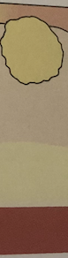

# Abscess
Q. Hvilken type infektion ses her?

A. [[Abscess]]

Q. Hvad er den hyppigste mekanisme for absces?
A. Stik med noget forurenet

Q. Hvordan behandles en overfladisk absces?
A. Kirurgisk udtømning + opheling fra bunden.

Q. Hvordan behandles en profund absces?
A. Dræn + skylning og AB.

Q. Hvad er det hyppigst bruge antibiotikum i ortopædkirurgien?
A. [[Dicloxacillin]]

Og virker derfor på de fleste s. aureus.

## Backlinks
* [[Abscess]]
	* Q. Hvilken type infektion ses her?
A. [[Abscess]]
* [[Follikulitis]]
	* Q. Du er i tvivl om din patient har [[Follikulitis]] eller en [[Furunkel]]. Hvorfor er det vigtigt at adskille? 
* [[Hidrosadenitis suppurativa]]
	* Q. Hvad ses her?
A. Kan være flere ting: [[Abscess]], [[Hidrosadenitis suppurativa]]
* [[Lokal knude på halsen]]
	* Q. Hvilke *infektiøse* differentialdiagnoser findes til [[Lokal knude på halsen]]?

<!-- #anki/tag/med/Orto #anki/deck/Medicine #anki/tag/med/Derma #anki/tag/med/Infectious -->

<!-- {BearID:5529D43F-3B5A-4B8B-AB1E-F9ADA9A7DA71-43570-00005167978B9F46} -->
