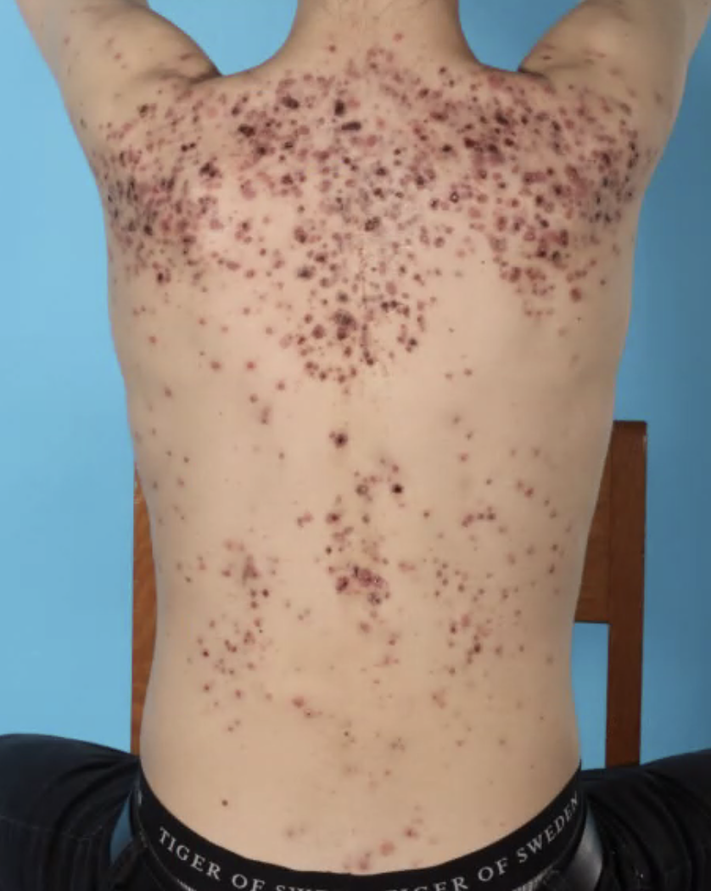

# Acne fulminans
## Generelt
Q. Beskriv eksantemet – Diagnose(r)?

A. Bilat., især øvre skulder, papiller med ulcerationer uden tegn på ekskoriation - [[Acne fulminans]]

## Differentialdiagnose

## Udredning
### Anamnese

### Objektiv us.

### Paraklinik

## Behandling
Q. Hvordan behandler vi mild [[Acne fulminans]]?
A. 1) [[Tetracyklin]] og 2) [[Prednisolon]] p.o. (og lokalt). Når ro i symptomerne, opstart [[Isotretinoin]].

Q. Hvad er det primære fokus under akut behandling af [[Acne fulminans]]?
A. 1) Undgå infektion/slå agens ned, 2) Behandl systemisk inflammation

## Opfølgning

## Prognose

<!-- #anki/tag/med/Derma #anki/deck/Medicine -->
## Backlinks
* [[Acne fulminans]]
	* Q. Beskriv eksantemet – Diagnose(r)?
A. Bilat., især øvre skulder, papiller med ulcerationer uden tegn på ekskoriation - [[Acne fulminans]]
	* Q. Hvordan behandler vi mild [[Acne fulminans]]?
	* Q. Hvad er det primære fokus under akut behandling af [[Acne fulminans]]?
* [[Akne]]
	* I worst case kan det progrediere til [[Acne fulminans]]

<!-- {BearID:1D4695CD-80EF-4A0C-A918-FEC5AF59FFC6-731-00000E043913A30B} -->
