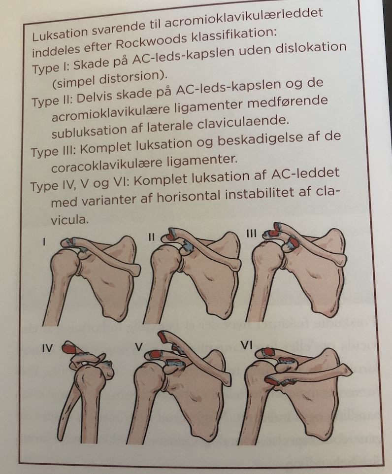

# Acromioclaviculær luksation
## Generelt

## Differentialdiagnose

## Udredning
### Anamnese

### Objektiv us.

### Paraklinik

## Behandling
Q. Hvordan behandles [[Acromioclaviculær luksation]]?
A. Aflastning i slynge + NSAID. Kirurgi hvis grad IV+, eller grad III med dårlig effekt af konservativ beh.

Q. Hvor

## Opfølgning

## Prognose

## Backlinks
* [[Acromioclaviculær luksation]]
	* Q. Hvordan behandles [[Acromioclaviculær luksation]]?
* [[§Skulderen]]
	* [[Traumatiske skulderlidelser]]
	
	[[Acromioclaviculær luksation]]
	[[Sternoclaviculær luksation]]
* [[Sternoclaviculær luksation]]
	* Q. Hvordan behandles [[Acromioclaviculær luksation]]?

<!-- #anki/tag/med/Orto #anki/deck/Medicine -->

<!-- {BearID:A516FE98-8BA9-4E59-9425-F198438CA340-76574-00009A41417A6D81} -->
