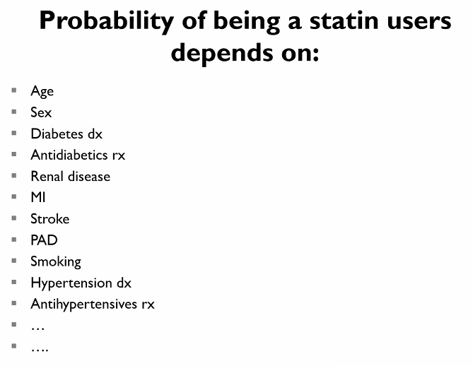
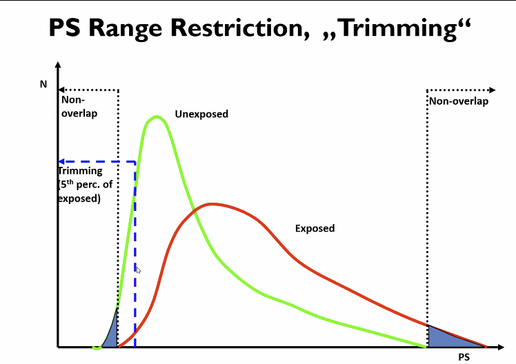
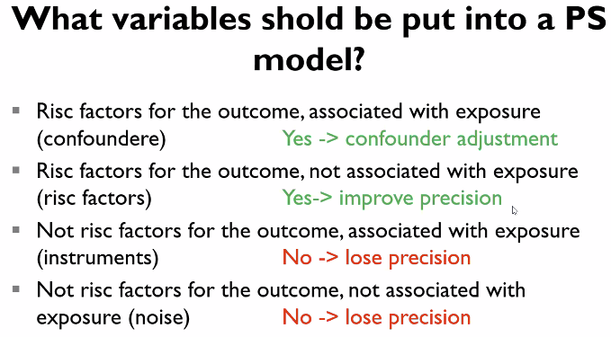
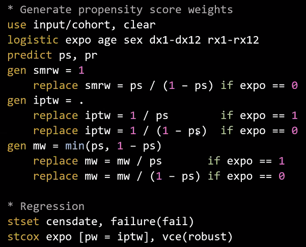

# Advanced Methods in Pharmacoepidemiology
*Propensity scores*
Assumptions:
* Positivity – all units must be able to receive treatment (eg. no absolute indication or contraindications)
Probably more, haven’t been talked about. 

A multivariate model of being treated.

Typically used for matching or as a covariate, to adjust for confounding. 
* Matching 
* Stratification 
* Inverse treatment probability weighting (ITPW): As a weighting criterion (1/PS for treated, 1/(1-PS) for untreated), eg. The reciprocal value of the probability of receiving the treatment than you actually receive
	* ITPW: What if we treated everyone in the whole population, vs. treating none of them?
	* PS: What if we hadn’t treated those who actually got the treatment?

Can’t adjust for unmeasured confounding.
	* Nearest neighbour
	* Sequential, balanced nearest neighbor
	* Greedy

In the case of covariate imbalance (eg. Cohen’s d > .1):
* Include it in the adjustment along with the PS or
* (Up-weigh it in the regression model that builds the PS)

We typically trim the tails, to remove those with near-absolute indications and contraindications (since they don’t really provide much information to us – those are the ones we know need treatment, or know shouldn’t have treatment. If treatment is contrary to prediction, it means something weird is going on. Eg. some prediction to unmeasured confounding (“clinical despair”, “we have to do something, even though we break the guidelines”).

Risk factors for the outcome but not associated with exposure, means that we match based on everything associated with the outcome except the main exposure. Removes noise on both sides (eg. exposed and unexposed), essentially.

* What are the advantages compared to using those variables specifically?
	* Smaller confidence intervals?, but a loss of information?

* How does it fit into a causal understanding of confounding?
	* Eg. how do we avoid collider-bias or over-adjustment bias?

## Weighting

<!-- {BearID:400D26FC-D345-4E40-B050-6A7FAEC5D1F7-2458-00000909ED8DC19F} -->
