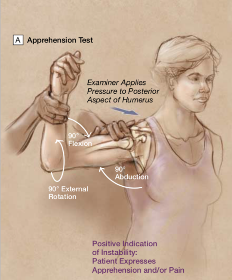

# Afværgetest i skulderen
Også kendt som apprehensionstest.

Q. Hvilke tests kan udføres for instabilitet i skulderleddet?
A. Afværgetest, skuffetest og sulcustest

Q. Beskriv *afværgetesten* i *skulderleddet*.
A. 

Q. Hvad tester *afværgetesten* i *skulderleddet* for?
A. [[Anterior skulderinstabilitet]]

Q. Hvad er en abnorm *afværgetest* for *skulderleddet*?
A. Patienten føler smerte ved udadrotation, afhjælpes ved posteriort pres på caput humeri

## Backlinks
* [[Anterior skulderluksation]]
	* Q. Din patient viser symptomer på [[Anterior skulderluksation]]. Hvad vil du tilføje *den objektive us.*? 
* [[Undersøgelse af skulder]]
	* [[Afværgetest i skulderen]]

<!-- #anki/tag/med/Orto #anki/deck/Medicine #anki/tag/med/GP -->

<!-- {BearID:F53A993E-951B-4052-B124-81F63FC1521E-53319-0000700B7A34D83B} -->
