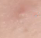
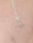
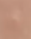
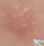

# Akne
## Generelt
Q. Hvilke morfologiske subtyper inddeles [[Acne]] i?
A. 1) Komedogen, 2) Papulopustuløs eller 3) Nodulocystisk

## Differentialdiagnose
Q. Din kvindelige patient har akne. Hvilken komorbiditet bør overvejes?
A. [[PCOS]]

Q. Hvordan adskilles [[Akne]] fra [[Rosacea]]?
A. Kun [[Akne]] har komedomer, kun [[Rosacea]] har telangieektasier

## Udredning
### Anamnese

### Objektiv us.

Papel

Åbent komedom (sort)

Lukket komedom (ikke sort)

Papel

Pustel (pus)

### Paraklinik

## Behandling
Q. Hvordan behandles acne?
*Mild*: Lokale midler ([[Adapalen]], [[Azalainsyre]], [[Benzoylperoxid]]). *Moderat*: Tillægges systemisk antibiotika (e.g. [[Tetracyklin]],[[Doxycyklin]]). *Svær*:[[Retinoider]] hos dermatolog

Q. Din patient med [[Akne]] er i behandling med [[Benzoylperoxid]] og systemisk [[Doxycyklin]]. Synes behandlingen er utilstrækkelig. Efter hvor lang tid bør overvejes optrapning til [[Retinoider]]?
A. 3 mdr.

Q. Hvilke faktorer bør saneres ved [[Akne]]?
A. 1) Kosmetik, 2) Medicin, 3) Rygning

	1. For kvinder, evt. antiandrogene p-piller

## Opfølgning

## Prognose
I worst case kan det progrediere til [[Acne fulminans]]

## Backlinks
* [[Akne]]
	* Q. Hvordan adskilles [[Akne]] fra [[Rosacea]]?
	* Q. Hvordan adskilles [[Akne]] fra [[Rosacea]]?
	* Q. Din patient med [[Akne]] er i behandling med [[Benzoylperoxid]] og systemisk [[Doxycyklin]]. Synes behandlingen er utilstrækkelig. Efter hvor lang tid bør overvejes optrapning til [[Retinoider]]?
	* Q. Hvilke faktorer bør saneres ved [[Akne]]?

<!-- #anki/tag/med/Derma #anki/deck/Medicine #anki/tag/med/GP -->

<!-- {BearID:2A9981C6-F268-4D86-A59A-AD14A3239F04-62499-00007C5115BA81CB} -->
