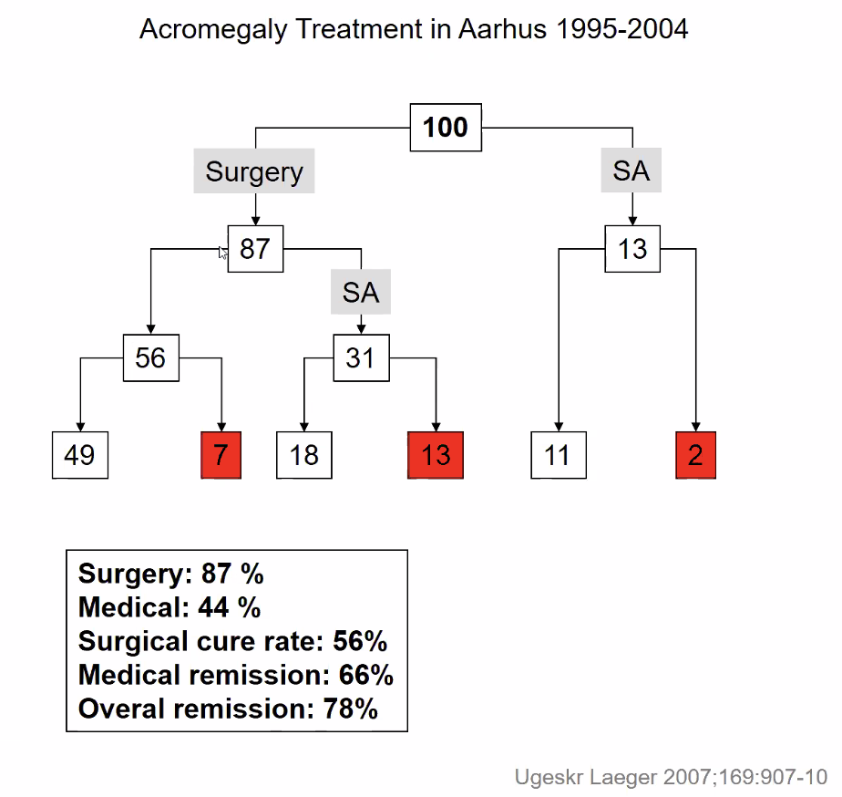

# Akromegali
I børn medfører samme mekanisme [[Gigantisme]].

# Generelt
Q. Hvad er de udløsende faktorer for [[Akromegali]]?
A. Typisk sporadisk, sjældent genetisk

Q. Hvad er typisk årsagen til [[GH]] sekretion ved [[Akromegali]]?
A. [[Hypofyseadenom]]

# Diagnose
Q. Hvad er symptomerne på [[Akromegali]]?
A. 1) Hovedpine, 2) Ledsmerter, 3) Træthed

Q. Hvilke kliniske fund tyder på [[Akromegali]]?
A. 1) Prominerende pande, 2) Mandibulær vækst med underbid, 3) Vækst af hænder og fødder

Q. Hvilken biokemisk test anvendes for at undersøge for akromegali?
A. [[OGTT]]

Q. Hvordan diagnosticeres [[Akromegali]]?
A. Klinik + [[OGTT]]

Q. Hvorfor kan man ikke bruge p-[[GH]] til diagnosticering af [[Akromegali]]?
A. Stor døgnvariation

# Behandling
Q. Hvordan behandles [[Akromegali]] typisk? 
A. 1) Kirurgi hvis muligt, 2) [[Somatostatin]] og [[GH-antagonist]] for at nå i mål.

# Opfølgning

# Prognose
Q. Via hvilke mekanismer påvirker [[Akromegali]] levetiden?
A. 1) CVD-problemer pga. kardiomegali, 2) Respiratoriske problemer

Q. Hvor meget nedsætter [[Akromegali]] levetiden?
A. Ca. 10 år

## Backlinks
* [[Akromegali]]
	* Q. Hvad er de udløsende faktorer for [[Akromegali]]?
	* Q. Hvad er typisk årsagen til [[GH]] sekretion ved [[Akromegali]]?
	* Q. Hvad er symptomerne på [[Akromegali]]?
	* Q. Hvilke kliniske fund tyder på [[Akromegali]]?
	* Q. Hvordan diagnosticeres [[Akromegali]]?
	* Q. Hvorfor kan man ikke bruge p-[[GH]] til diagnosticering af [[Akromegali]]?
	* Q. Hvordan behandles [[Akromegali]] typisk? 
	* Q. Via hvilke mekanismer påvirker [[Akromegali]] levetiden?
	* Q. Hvor meget nedsætter [[Akromegali]] levetiden?
* [[GH]]
	* Q. Hvilken sygdom leder *hyper*sekretion af [[GH]] til? 
* [[PCOS]]
	* [[Akromegali]], [[Hyperprolaktinæmi]],  [[Hyperthyreose (for udredning, se Thyrotoxikose)]], [[Hyperthyreose (for udredning, se Thyrotoxikose)]], [[Cushing’s syndrom]], [[Primær hypogonadisme]]
* [[Hyperprolaktinæmi]]
	* Q. Hvilke *endokrine* årsager findes til [[Hyperprolaktinæmi]]?
* [[Principper for endokrinologisk funktionsundersøgelse]]
	* [[Akromegali]]

<!-- #anki/tag/med/Endocrinology #anki/deck/Medicine -->

<!-- {BearID:146A045F-79FB-4993-A495-D6B98EDDE9B6-58207-00004DCBBF9E83E6} -->
