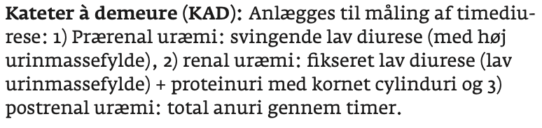
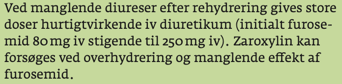

# Akut nyresvigt (AKI)
## Generelt
[[Prærenalt nyresvigt]]
[[Intrarenalt nyresvigt]]
[[Postrenalt nyresvigt]]

## Differentialdiagnose

## Udredning
### Anamnese

### Objektiv us.

### Paraklinik

Stiles mod timediureser på 1-2 ml/kg/t.

Akut ultralyd.

## Behandling
Søg desuden på “væskestød” i anki.sp

## Opfølgning

## Prognose
 

## Backlinks
* [[Forbrænding]]
	* Q. En patient har nedsat nyrefunktion dagen efter en forbrænding. Hvad skyldes det? 

<!-- #anki/deck/Medicine# #anki/tag/med/Nephrology #anki/tag/med/Acute care# -->

<!-- {BearID:8D2983B0-390B-40DC-A1F1-ADAFD7A68B72-54388-0000817A500A95C0} -->
