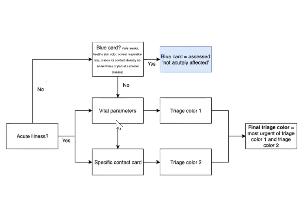

# Akutmedicin
12/03/2021

## Triagering

Hvert triagekort har en separat algoritme.

[[Bevidsthedspåvirkning]]

<!-- #anki/tag/med/gp #anki/deck/Medicine #lecture -->

<!-- {BearID:CDB1F990-C97D-4089-B320-394CC573C91A-3994-000009BB542C00A1} -->
