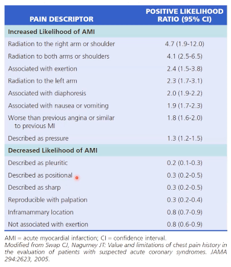

# Akutte brystsmerter
[Brystsmerter – FraseDoktor](https://www.frasedoktor.dk/fraser/brystsmerter/)

## Generelt

## Differentialdiagnose
Q. Hvilke *vaskulære* differentialdiagnoser findes til [[Akutte brystsmerter]]?
A. 1) [[Akut koronart syndrom (AKS)]], 2) [[Aortadissektion]], 3) [[Lungeemboli]]

Q. Hvilke *idiopatiske* differentialdiagnoser findes til [[Akutte brystsmerter]]?
A. [[Cholecystolithiasis]], [[Akut pancreatitis]]

Q. Hvilke *infektiøse* differentialdiagnoser findes til [[Akutte brystsmerter]]?
A. [[Pneumoni]], [[Pericarditis]], [[Herpes zoster]]

Q. Hvilke *traumatiske* differentialdiagnoser findes til [[Akutte brystsmerter]]?
A. [[Costafraktur]] -> [[Pneumothorax]]

Q. Hvilke *behavioristiske* differentialdiagnoser findes til [[Akutte brystsmerter]]?
A. [[Angst]]

## Udredning
### Anamnese
Q. Hvad vil du spørge om til SOCR *A* TES for [[Akutte brystsmerter]] 
A. 1) (Nær)[[§Synkope]], 2) [[Synsforstyrrelser]], 3) [[Hoste]], 4) [[Dyspnø]], 5) [[Kvalme]]

### Objektiv us.

### Paraklinik
Q. Din patient viser symptomer på [[Akutte brystsmerter]]. Hvad vil du tilføje til *paraklinikken*? 
A. 1) [[Rtg. thorax]], 2) [[EKG]], og alt efter symptomer 3) [[Troponin]] og 4) [[CK-MB]], altid 5) [[P-amylase]]

Q. Hvorfor tages [[P-amylase]] altid ved [[Akutte brystsmerter]]?
A. OBS [[Akut pancreatitis]], der kan give lignende symptomer.

## Behandling

## Opfølgning

## Prognose

## Backlinks
* [[Herpes zoster]]
	* [[Akutte brystsmerter]]
	* Q. Hvilke *infektiøse* differentialdiagnoser findes til [[Akutte brystsmerter]]?
* [[Akutte brystsmerter]]
	* Q. Hvilke *vaskulære* differentialdiagnoser findes til [[Akutte brystsmerter]]?
	* Q. Hvilke *idiopatiske* differentialdiagnoser findes til [[Akutte brystsmerter]]?
	* Q. Hvilke *infektiøse* differentialdiagnoser findes til [[Akutte brystsmerter]]?
	* Q. Hvilke *traumatiske* differentialdiagnoser findes til [[Akutte brystsmerter]]?
	* Q. Hvilke *behavioristiske* differentialdiagnoser findes til [[Akutte brystsmerter]]?
	* Q. Hvad vil du spørge om til SOCR *A* TES for [[Akutte brystsmerter]] 
	* Q. Din patient viser symptomer på [[Akutte brystsmerter]]. Hvad vil du tilføje til *paraklinikken*? 
	* Q. Hvorfor tages [[P-amylase]] altid ved [[Akutte brystsmerter]]?
* [[Brystsmerter]]
	* [[Akutte brystsmerter]]

<!-- #anki/tag/med/Cardiology #anki/deck/Medicine #anki/tag/med/GP -->

<!-- {BearID:CE103B60-D51B-44A9-AE5A-768DBD852055-3083-00000F97E8AA0655} -->
