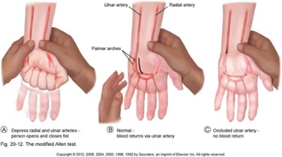

# Allens test
Q. Beskriv *[[Allens test]]* i håndleddet.
A. 

Q. Hvad tester *Allens test* for i håndleddet?
A. Om der er cirkulation i a. ulnaris og a. ulnaris

Q. Hvad er et abnormt resultat af *Allens test* i håndleddet?
A. Fortsat bleghed efter åbning af a. ulnaris
 

## Backlinks
* [[Allens test]]
	* Q. Beskriv *[[Allens test]]* i håndleddet.

* [[Karpaltunnelsyndrom]]
	* Q. Din patient viser symptomer på [[Karpaltunnelsyndrom]]. Hvad vil du tilføje *den objektive us.*? 
	* Q. Hvorfor udføres [[Allens test]] ved OBS [[Karpaltunnelsyndrom]]?

<!-- #anki/tag/med/Orto #anki/deck/Medicine -->

<!-- {BearID:7DF69536-6303-4C8F-90A5-74D5E1FBB99B-20983-0000251F5F0F6815} -->
