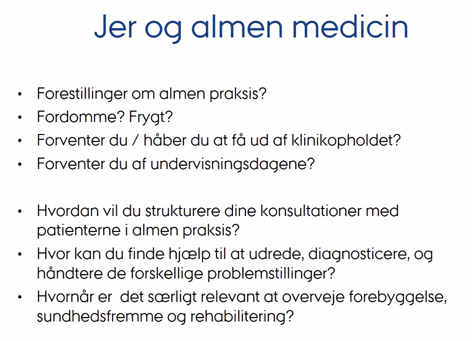

# Almen praksis
15/03/2021

padlet.com/anders_prior/m9f6n6gkkopg

Forestillinger:
* Presset på tid
* Både meget simple og meget komplicerede patienter
* Dårlig tid til kontakt med kolleger, kontinuert aktivering (ala. samlebånd)
* En deltager har anden oplevelse: bedre kendskab til kollegerne, bedre tid til korte spørgsmål som man kan nå ad hoc

<!-- #anki/tag/med/GP -->

<!-- {BearID:9B06932F-4DA5-413B-9912-B699546DCF2E-41500-00003438BBE9E378} -->
