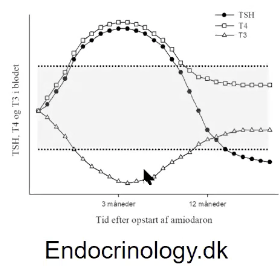

# Amiodaron
## Generelt
Giver forventelig påvirkning af stofskiftet.

## Differentialdiagnose

## Udredning
### Anamnese

### Objektiv us.

### Paraklinik

## Behandling

## Opfølgning

## Prognose
Q. Hvordan adskilles ved [[Amiodaron]] normal fra abnorm thyroideapåvirkning?
A. Normal er let og følger kurve, abnorm er svær [[Hyperthyreose (for udredning, se Thyrotoxikose)]].

## Backlinks
* [[Amiodaron]]
	* Q. Hvordan adskilles ved [[Amiodaron]] normal fra abnorm thyroideapåvirkning?

* [[Hjertestop hos voksne]]
	* Q. Din patient har hjertestop, og der er netop givet 3. stød. Hvad nu?

<!-- #anki/tag/med/Cardiology #anki/deck/Medicine -->

<!-- {BearID:80B27C51-AC3E-45B2-A84B-BB3DB7CD13F5-71192-00010B73E612DBDB} -->
