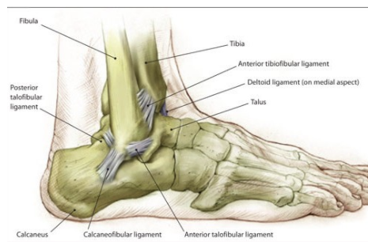

# Ankelligamentlæsioner
Ligementlæsioner i [[§Ankel]]

Q. Benævn de laterale ligamenter i anklen
A. Lig. tibiofibulare ant., talofibulare ant. og calcaneofibulare

Q. Hvad er behandlingen af ankelforstrækning?
A. ICE: (Ice, Compression, Elevation), dernæst genoptræning af mekanoreceptorer på balanceplade i 4-6 uger.

Q. Hvor lang tid er en ankelforstuvning typisk hævet?
A. Uger til måneder pga. bruskskade i talus

[[Ankelsenelæsioner]]

## Backlinks
* [[Ankeltraume]]
	* OBS [[Malleolfraktur]], [[Jones fraktur]], [[Ankelligamentlæsioner]], [[Ankelsenelæsioner]]
* [[§Ankel]]
	* [[Ankeltraume]]
	[[Ankelsenelæsioner]]
	[[Ankelfrakturer]]
		[[Malleolfraktur]]
		[[Jones fraktur]]

<!-- #anki/tag/med/Orto #anki/deck/Medicine -->

<!-- {BearID:63E4C1B1-979F-4E35-8C67-3A928C71884B-9907-00007CB676DC3CB8} -->
