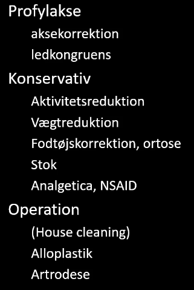

# Artrose i ankel
65% post-traume
15% primær artrose
15% inflam. artritis
5% andet

Protese hjælper på bevægelighed, det gør artrodesen ikke. Artrodesen er nemmere.

<!-- #anki/tag/med/Orto #anki/deck/Medicine -->

<!-- {BearID:45C842C6-1EDE-4576-8B64-7F249F399E9C-97624-0000BAABDC43F373} -->
