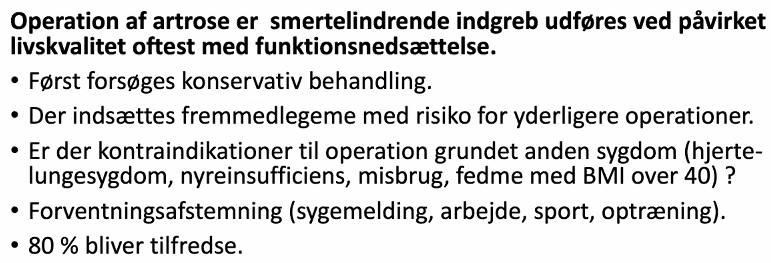
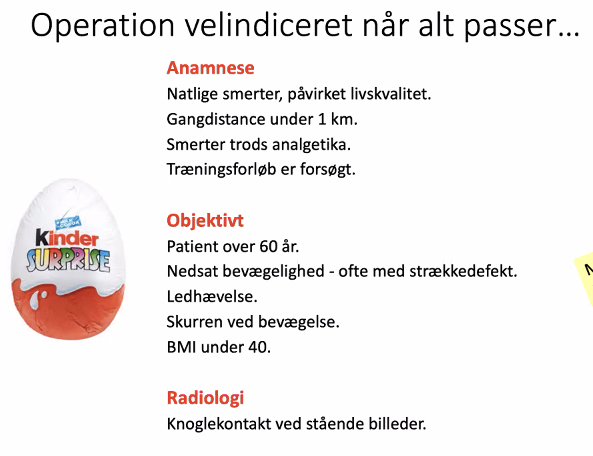
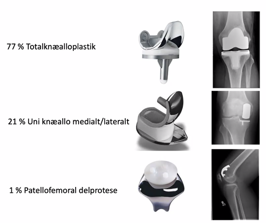
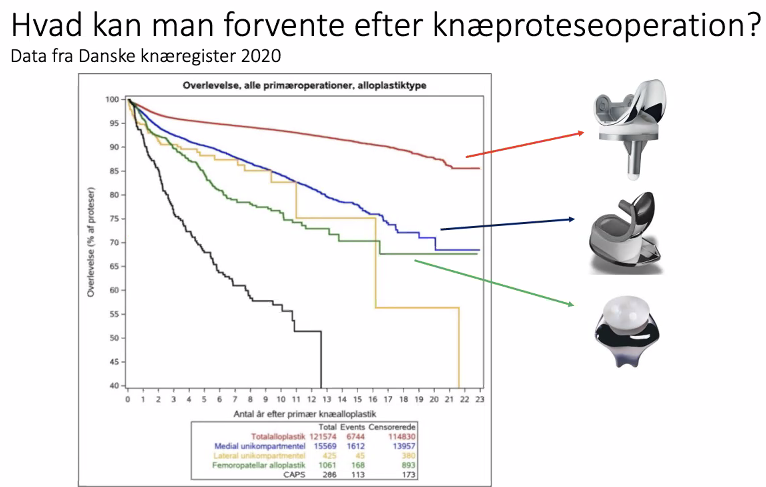

# Artrose i knæ
## Generelt
Artrose i [[§Knæet]]

## Differentialdiagnose

## Udredning
### Anamnese

### Objektiv us.

### Paraklinik
Q. Hvilke rtg.-billeder bør tages af knæ?
A. AP, lateralt og “skyline”

Med “skyline” menes oppefra, så man kan se ind i patellofemoralleddet.

Q. Hvilke ledkamre findes i knæet?
A. Lateralt, medialt og patellofemoralt

Q. Hvordan spørges til ledsvigt i knæ?
A. Forsvinder dit ben under dig i ujævnt terræn?

## Behandling

60 år for at undgå, at protesen er udslidt mens pt. er levende.

Hvis der ikke er knoglekontakt ved stående billeder, så er succesraten på 50% i stedet for de 80%.

Typer proteser:

Q. Hvilke typer knæalloplastik findes?
A. 1) Patellofemoral, 2) Uni-knæ, 3) Total

Q. En patient har fået steroidblokade i et led. De vil gerne opereres nu. Hvad så? 
A. Kan først opereres efter 3 mdr., OBS risiko for skærmning af postoperativ infektion

11.000 alloplastikker i 2019, gennemsnitsalder 68 år.

Efter 10 år er ca. 10% genopererede.

## Opfølgning

## Prognose
 

<!-- #anki/tag/med/Orto #anki/deck/Medicine -->

## Backlinks
* [[§Knæet]]
	* [[Artrose i knæ]]
* [[Degenerative knælidelser]]
	* [[§Artrose]]

<!-- #anki/tag/med/Orto #anki/deck/Medicine -->

<!-- {BearID:DCB9C8A5-134D-49FD-A34A-EC06FEF2250C-9395-00001DCEAD08E901} -->
