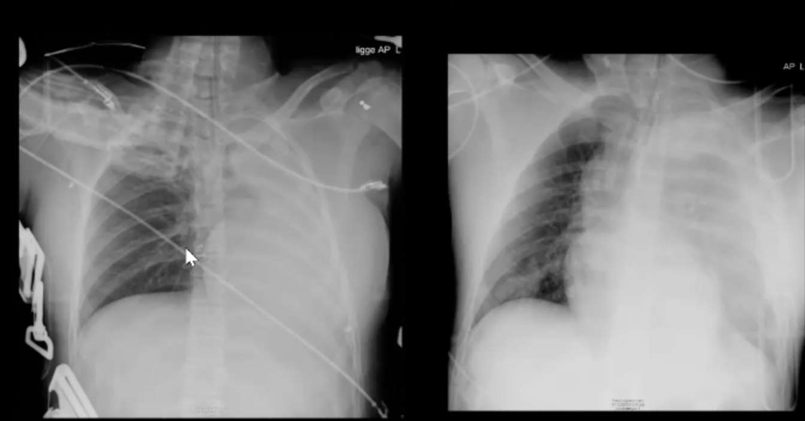

# Atelektase
## Generelt

## Differentialdiagnose

## Udredning
### Anamnese

### Objektiv us.

### Paraklinik
Q. Hvad ses til højre og venstre?

A. Venstre: [[Atelektase]]. Højre: [[Hæmothorax]]. 

Q. Hvordan adskilles [[Atelektase]] fra [[Hæmothorax]] på [[Rtg. thorax]]?
A. Hæmothorax skubber hjertet, atelektase “trækker”.

## Behandling

## Opfølgning

## Prognose

## Backlinks
* [[Atelektase]]
	* Q. Hvad ses til højre og venstre?
A. Venstre: [[Atelektase]]. Højre: [[Hæmothorax]]. 
	* Q. Hvordan adskilles [[Atelektase]] fra [[Hæmothorax]] på [[Rtg. thorax]]?

<!-- #anki/deck/Medicine #anki/tag/med/Lung medicine# #anki/tag/med/Acute care# -->

<!-- {BearID:ECA176BC-D9A4-4016-84FF-777552A355E9-6820-000015C76CA7E74E} -->
