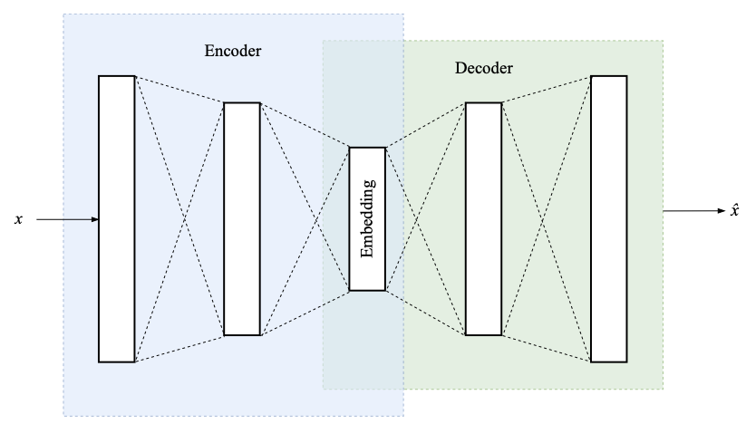

# Autoencoder
<!-- #anki/deck/ML -->

Q. 

What is this an illustration of?
A. An autoencoder

Q. What is the advantage of an autoencoder?
A. Learns only the important features of the input

Q. How does an autoencoder know if it has learned the important features of the input?
A. It compares its output to the input

<!-- {BearID:CE8455F3-CC57-4D2B-A4AD-4438C4DB9479-13135-0000177D70135C74} -->
