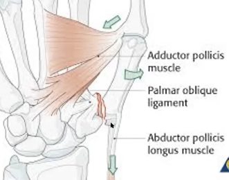
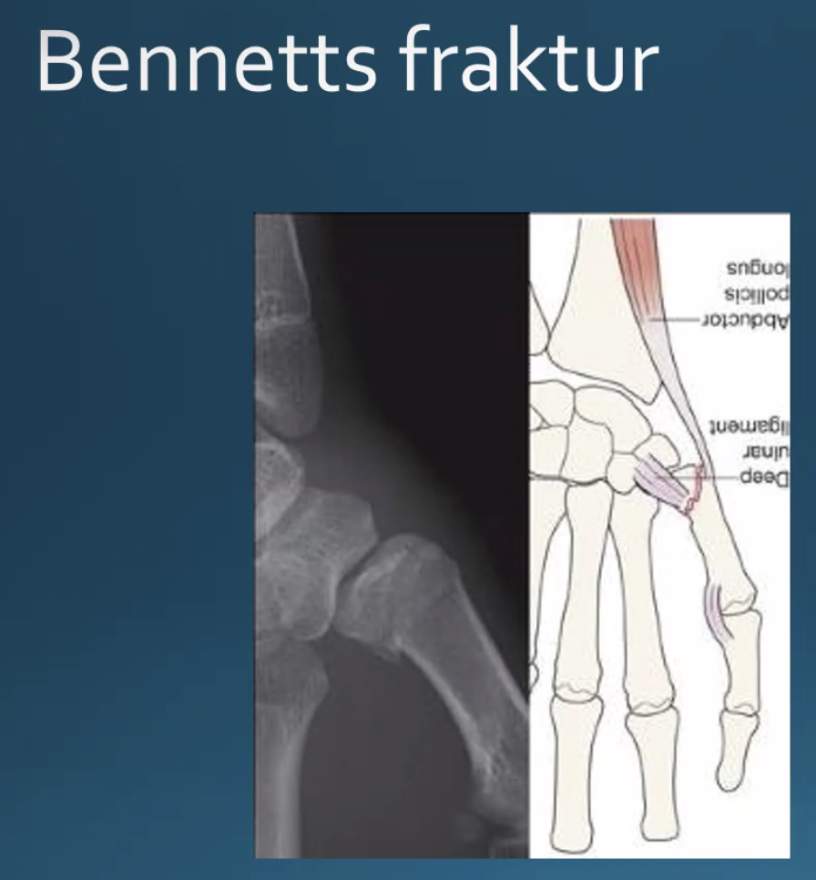

# Bennetts fraktur
## Generelt
Q. Hvad menes i sundhedsvæsenet med *[[Bennetts fraktur]]*? 
A. *Fraktur basalt i 1. metakarp med ulnar afsprængning*

Q. Hvad hedder *Fraktur basalt i 1. metakarp med ulnar afsprængning* i sundhedsvæsenet? 
A. *[[Bennetts fraktur]]* 

Q. Hvad er mekanismen bag en [[Bennetts fraktur]]?
A. Forceret abduktion af 1. metakarp

 

## Differentialdiagnose

## Udredning
### Anamnese
Fald på radialsiden af hånd.

### Objektiv us.

### Paraklinik

## Behandling
Q. Hvordan behandles en [[Bennetts fraktur]]?
A. 1) Reponering, 2) Stabilisering med K-tråde *uden* involvering af det ulnare fragment, 3) Radial kantgips i 5 uger. (Dvs. aldrig konservativt pga. muskeltræk).

## Opfølgning

## Prognose
 

## Backlinks
* [[Bennetts fraktur]]
	* Q. Hvad menes i sundhedsvæsenet med *[[Bennetts fraktur]]*? 
	* Q. Hvad hedder *Fraktur basalt i 1. metakarp med ulnar afsprængning* i sundhedsvæsenet? 
	* Q. Hvad er mekanismen bag en [[Bennetts fraktur]]?
	* Q. Hvordan behandles en [[Bennetts fraktur]]?

* [[Tommelfingersmerter]]
	* [[Mb. Kienbock]]

<!-- #anki/tag/med/Orto #anki/deck/Medicine -->

<!-- {BearID:D1F9382E-0796-4233-9E28-495B0392F683-8519-000017BE7628498B} -->
