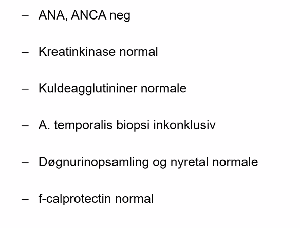

# Bindevævssygdomme
[[SLE (systemisk lupus erythematosus)]]
[[Dermatomyositis]]
	Tænk OBS cancer

DDX
	Infektion
		[[Acrodermatitis chronica atrophicans]]

<!-- #anki/tag/med/Derma #anki/deck/Medicine #anki/tag/med/Rheumatology -->

<!-- {BearID:230DBF5B-4020-4A92-8841-881E85FE5A9A-4682-00001047989A3C94} -->
