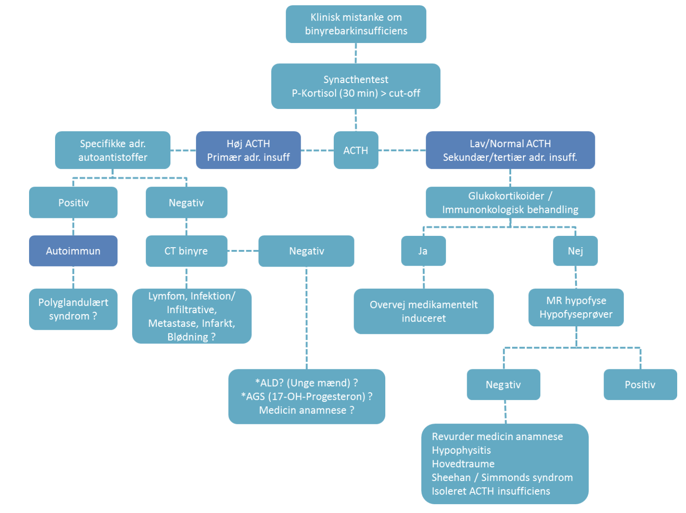

# Binyrebarkinsufficiens
## Generelt
[[Akut binyrebarkinsufficiens (brug addisonkrise)]]
[[Primær binyrebarkinsufficiens]]
[[Sekundær binyrebarkinsufficiens]]

## Differentialdiagnose

## Udredning
### Anamnese

### Objektiv us.

### Paraklinik
Q. Hvordan adskiller man diagnostisk [[Primær binyrebarkinsufficiens]] og [[Sekundær binyrebarkinsufficiens]]?
A. [[Synacthentest]]

Q. Din patient viser symptomer på [[Primær binyrebarkinsufficiens]]. Hvad vil du tilføje til *paraklinikken*? 
A. 1) [[Synacthentest]], 2) [[ACTH]], dernæst efter flowchart

Q. Din patient har [[Primær binyrebarkinsufficiens]] ([[Synacthentest]] abnorm, [[ACTH]] er høj). Hvad nu?
A. 1) Autoantistoffer, hvis negative 2) CT binyre

[Binyrebarkinsufficiens - Dansk Endokrinologisk Selskab](https://endocrinology.dk/nbv/hypofyse-og-binyresygdomme/binyrebarkinsufficiens/)

## Behandling

## Opfølgning

## Prognose

## Backlinks
* [[Primær binyrebarkinsufficiens]]
	* *Se [[Binyrebarkinsufficiens]]*
* [[Sekundær binyrebarkinsufficiens]]
	* For udredning, se [[Binyrebarkinsufficiens]].
* [[Synacthentest]]
	* Q. Hvilke årsager er der til manglende [[Cortisol]]-stimulation efter [[Synacthentest]]?
* [[§Hyponatriæmi]]
	* Q. Hvad er de primære årsager til [[Normohydreret hyponatriæmi]]?
* [[Træthed]]
	* [[Polymyalgia rheumatica]]
[[Cushing’s syndrom]]
[[Binyrebarkinsufficiens]]

<!-- #anki/tag/med/Endocrinology #anki/deck/Medicine -->

<!-- {BearID:CEF9DFED-94E7-4C29-B076-EC9D12B5DCDB-959-00000C9FA26FFDF0} -->
