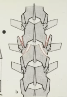

# Burstfraktur
## Generelt

## Differentialdiagnose

## Udredning
### Anamnese

### Objektiv us.

### Paraklinik
Q. Hvordan ses en [[Burstfraktur]] på et AP-rtg.?
A. Forøget pedikel-afstand.

## Behandling

## Opfølgning

## Prognose
 

## Backlinks
* [[Burstfraktur]]
	* Q. Hvordan ses en [[Burstfraktur]] på et AP-rtg.?

* [[§Ryggen]]
	* [[Columnafraktur]]
	[[Chance-fraktur]]
	[[Kompressionsfraktur]]

<!-- #anki/tag/med/Orto #anki/deck/Medicine -->

<!-- {BearID:B8EF35B0-525D-4378-8AF5-673748B182E5-20440-0000305830DB1292} -->
