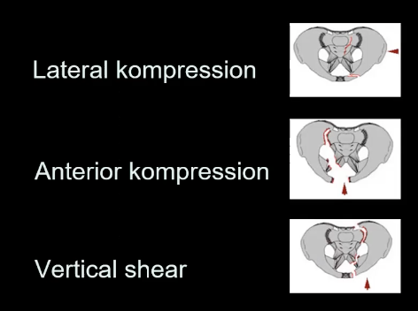
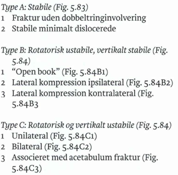
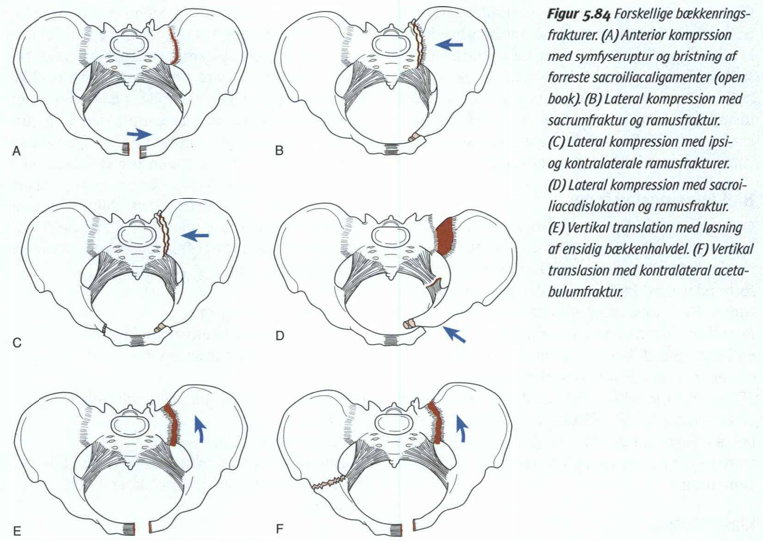
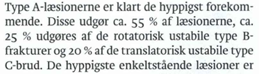

# Bækkenringslæsioner
## Generelt
Q. Hvilke knogler indgår i bækkenringen?
A. [[Os ilium]], [[Os ischii]], [[Os pubis]] og [[Os saccrum]]

Q. Hvordan opstår [[Bækkenringslæsioner]] typisk?
A. Højenergitraume

## Differentialdiagnose

## Udredning
### Anamnese

### Objektiv us.

### Paraklinik

## Behandling
Q. Hvordan behandles ustabile bækkenfrakturer?
A. Enten ekstern eller intern fiksation (skinne/skruer)

## Opfølgning

## Prognose
Q. Hvilke senkomplikationer ses til operation af ustabil bækkenfraktur?
A. Smerter, neurologisk dysfunktion, urologisk gener og sexuel dysfunktion

Q. Hvad betyder det, at en fraktur er “komminut”?
A. Knoglen er brækket i mere end 2 stykker

## Backlinks
* [[Bækkenringslæsioner]]
	* Q. Hvordan opstår [[Bækkenringslæsioner]] typisk?
* [[Bækkenfraktur]]
	* [[Marginale bækkenfrakturer]]

<!-- #anki/tag/med/Orto #anki/deck/Medicine -->

<!-- {BearID:F271406E-8BD7-4D75-B823-117EBDDB2ADE-7151-00000F13355255C2} -->
