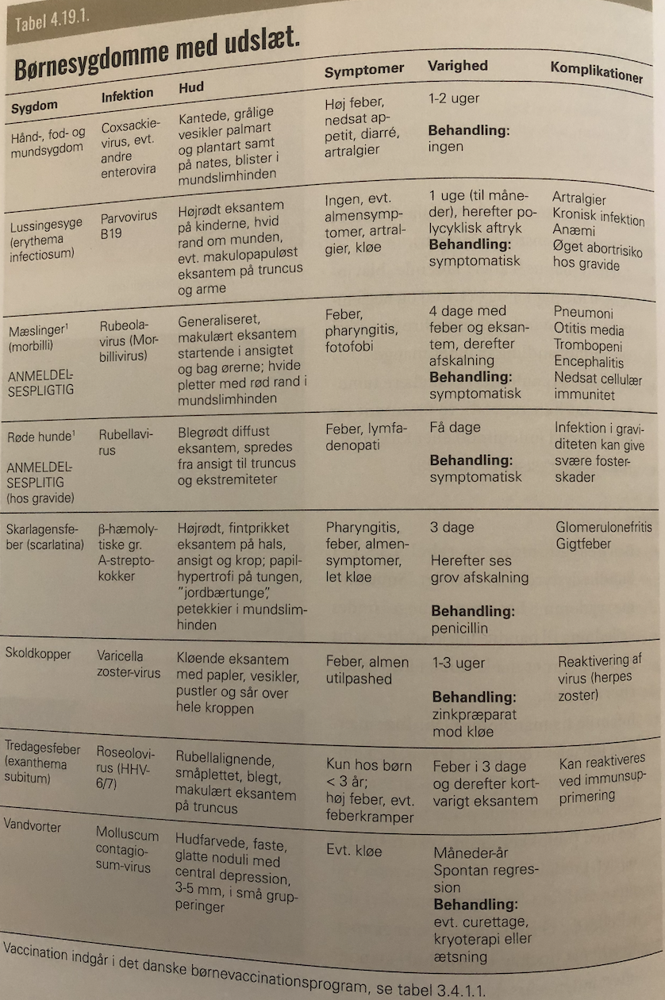

# Børneinfektioner i huden
Se også [[Smitsomme sygdomme hos børn og unge]].

* [[Impetigo]]
* [[Hand-, foot- and mouth disease]]
* [[Erythema infectiosum]]
* [[Morbillivirus]]
* [[Rubella]]
* [[Scarlatina]]
* [[Varicella zoster-virus]]
* [[Exanthema subitum]]
* [[Molluscum contagiosum]]
* [[Dermatofytose (tinea)]]

<!-- #anki/tag/med/Derma #anki/deck/Medicine #anki/tag/med/GP #anki/tag/med/Infectious -->

<!-- {BearID:FD1BAA42-C5D7-4392-9016-8721E4775808-62499-00007E0FB8883F6C} -->
