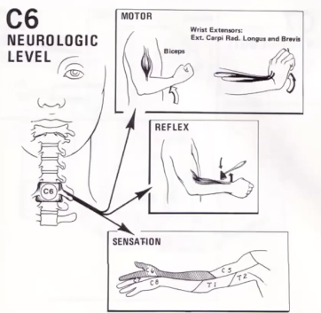

# C6 affektion
## Generelt
Q. Hvilke symptomer og objektive fund vil ses ved C*6*-nerverodsaffektion?
A. Aktiv mobilitet/kraft: Biceps og brachioradialis-svækkelse. Tab af brachioradialisrefleks. Sensorisk: Påvirket sensorium på radial underarm, tommel og pegefinger.

## Differentialdiagnose

## Udredning
### Anamnese

### Objektiv us.

### Paraklinik

## Behandling

## Opfølgning

## Prognose
 

## Backlinks
* [[Cervikal tværsnitslæsion]]
	* [[C5 affektion]]
[[C7 affektion]]
[[C8 affektion]]
* [[Us. af ryg]]
	* [[C5 affektion]], [[C6 affektion]], [[C7 affektion]], [[C8 affektion]]

<!-- #anki/tag/med/Orto #anki/deck/Medicine #1. med/seed# -->

<!-- {BearID:471C499B-08AE-4E60-8FE0-B74C56F58ADE-16437-00004D9E4528054E} -->
