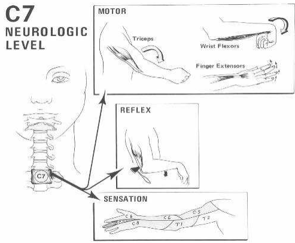

# C7 affektion
## Generelt
Q. Hvilke symptomer og objektive fund vil ses ved C*7*-nerverodsaffektion?
A. Aktiv mobilitet/kraft: Triceps og fingerekstensionssvækkelse. Tab af tricepsrefleks. Sensorisk: Påvirket sensorium på langefinger.

## Differentialdiagnose

## Udredning
### Anamnese

### Objektiv us.

### Paraklinik

## Behandling

## Opfølgning

## Prognose
 

## Backlinks
* [[Cervikal tværsnitslæsion]]
	* [[C5 affektion]]
[[C7 affektion]]
[[C8 affektion]]
* [[Us. af ryg]]
	* [[C5 affektion]], [[C6 affektion]], [[C7 affektion]], [[C8 affektion]]

<!-- #anki/tag/med/Orto #anki/deck/Medicine #1. med/seed# -->

<!-- {BearID:D8AF08CE-770E-474F-9AF8-34CA40EF4C97-16437-00004D9ECA9227DA} -->
