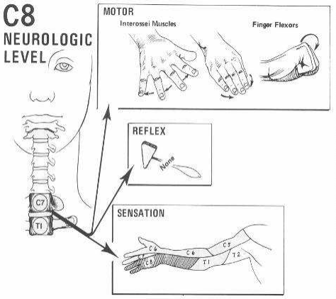
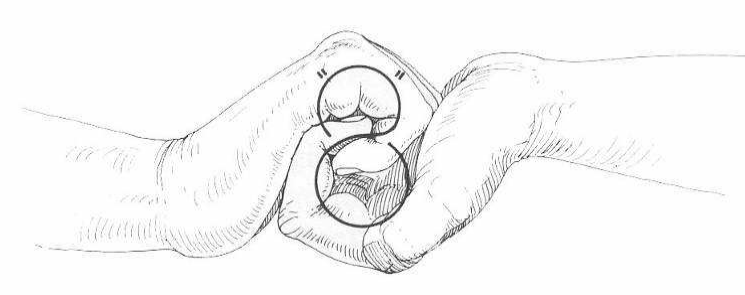

# C8 affektion
## Generelt
Q. Hvilke symptomer og objektive fund vil ses ved C*8*-nerverodsaffektion?
A. Aktiv mobilitet og kraft: Svækkelse af samle/sprede fingre, fingerfleksorer. Sensorisk: Påvirket sensorium på ulnar underarm, ringefinger og lillefinger.

## Differentialdiagnose

## Udredning
### Anamnese

### Objektiv us.

### Paraklinik

## Behandling

## Opfølgning

## Prognose
 

## Backlinks
* [[Cervikal tværsnitslæsion]]
	* [[C5 affektion]]
[[C7 affektion]]
[[C8 affektion]]
* [[Us. af ryg]]
	* [[C5 affektion]], [[C6 affektion]], [[C7 affektion]], [[C8 affektion]]

<!-- #anki/tag/med/Orto #anki/deck/Medicine #1. med/seed# -->

<!-- {BearID:FE8BC687-6258-46D5-9723-F7C519958F9A-16437-00004D9F36CB37E6} -->
