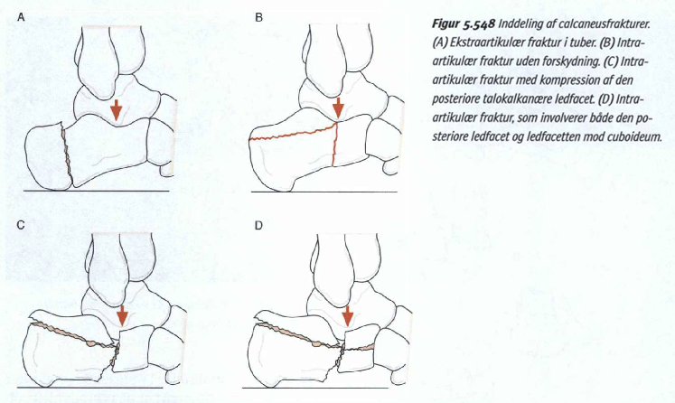

# Calcaneusfraktur
## Generelt
Fraktur i [[Os Calcaneus]]. Opdeles i intra- og ekstraartikulære. 

Ekstraartikulære er eksempelvis afrivning af tuber ved tendo achilles, intraartikulære er i ledfladen. 

De intraartikulære har, ligesom andre intraartikulære frakturer, stor tendens til sekundær [[§Artrose]].

Q. Hvad er den primære mekanisme bag [[Calcaneusfraktur]]?
A. Fald fra højde

## Differentialdiagnose

## Udredning
### Anamnese

### Objektiv us.
Q. Hvilke objektive fund vil tyde på *[[Calcaneusfraktur]]*? 
A. Blodudtrækning i fodsålen

Q. Din patient viser symptomer på [[Calcaneusfraktur]]. Hvad vil du tilføje *den objektive us.*? 
A. 1) Undersøgelse af columna (1/3 har frakturer her også), 2) [[Thompsons test]]

### Paraklinik
Q. Din patient viser symptomer på [[Calcaneusfraktur]]. Hvad tilføjer du til *paraklinikken*? 
A. Rtg fod + columna (!!!). Hvis positiv, CT.

Q. Hvad menes med [[Böhlervinklen]]?
A. Vinkel mellem 1) Overkanten af tuber calcanei og 2) Processus anterior calcanei til facies interarticulare posterior.

Q. Hvor stor er [[Böhlervinklen]] normalt?
A. 30 grader

## Behandling
Q. Hvad er den typiske behandling af intraartikulær [[Calcaneusfraktur]]?
A. Overvejende osteosyntese

Q. Din patient har [[Calcaneusfraktur]]. Under hvilke omstændigheder vil du overveje at behandle med osteosyntese? 
A. 1) Huden uden bulladannelse, 2) Normal blodforsyning, 3) 3 eller færre fragmenter

Q. Hvorfor vil man overveje osteosyntese af [[Calcaneusfraktur]]?
1) Mere normale proportioner, 2) Mindre risiko for sekundær artrose

## Opfølgning

## Prognose
Q. Hvad er de primære senfølger ved [[Calcaneusfraktur]]?
A. 1) Stivhed i bagfoden og efterfølgende 2) Artrose

## Backlinks
* [[Calcaneusfraktur]]
	* Q. Hvad er den primære mekanisme bag [[Calcaneusfraktur]]?
	* Q. Hvilke objektive fund vil tyde på *[[Calcaneusfraktur]]*? 
	* Q. Din patient viser symptomer på [[Calcaneusfraktur]]. Hvad vil du tilføje *den objektive us.*? 
	* Q. Din patient viser symptomer på [[Calcaneusfraktur]]. Hvad tilføjer du til *paraklinikken*? 
	* Q. Hvad er den typiske behandling af intraartikulær [[Calcaneusfraktur]]?
	* Q. Din patient har [[Calcaneusfraktur]]. Under hvilke omstændigheder vil du overveje at behandle med osteosyntese? 
	* Q. Hvorfor vil man overveje osteosyntese af [[Calcaneusfraktur]]?
	* Q. Hvad er de primære senfølger ved [[Calcaneusfraktur]]?
* [[Lisfrancs luksation]]
	* Q. Din patient har en ekkymose plantart. Hvad mistænker du?
* [[Ankelfrakturer]]
	* [[Talusfraktur]]

<!-- #anki/tag/med/Orto #anki/deck/Medicine -->

<!-- {BearID:CE027EB2-9E95-4A94-BE20-F701223A70FB-97624-0000BC8F3196FEAC} -->
