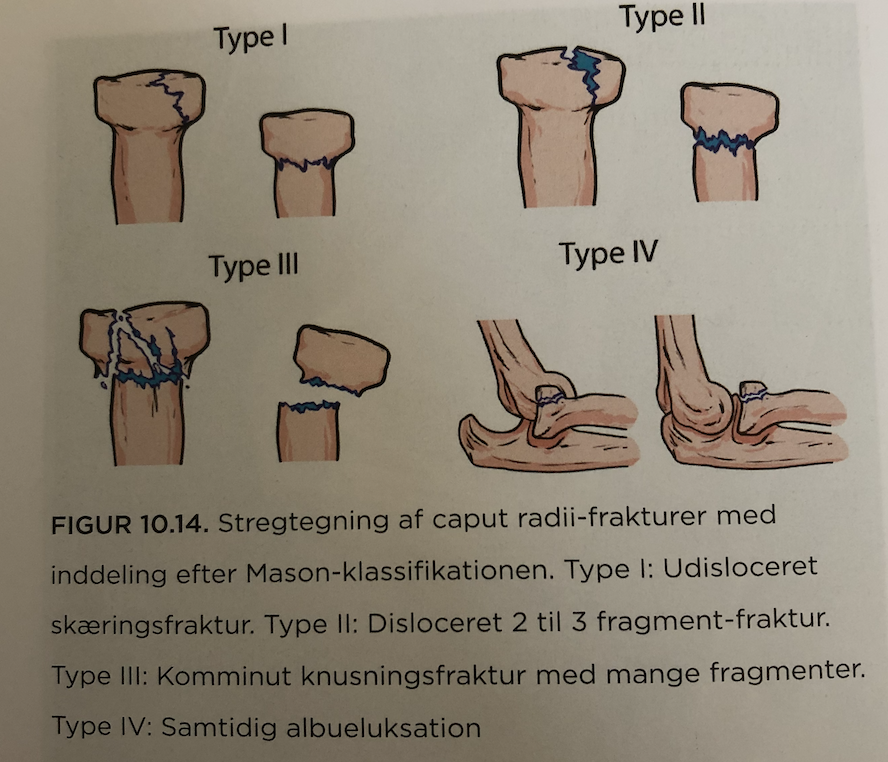
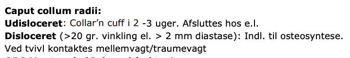

# Caput radii fraktur
## Generelt
[[Mejselfraktur]].

Q. Hvilket system bruges i sundhedsvæsenet til klassifikation af *[[Caput radii fraktur]]*? 
A. *[[Mason-klassifikationen]]*

Q. Hvad bruges *[[Mason-klassifikationen]]* til i sundhedsvæsenet? 
A. Klassifikation af *[[Caput radii fraktur]]* 

Q. Beskriv klassifikationen af *[[Caput radii fraktur]]* i sundhedsvæsenet. 
A. 1) Udisloceret, 2)  Disloceret til 2-3 fragmenter, 3) Komminut mange fragmenter, 4) Med albueluksation

## Differentialdiagnose

## Udredning
### Anamnese

### Objektiv us.

### Paraklinik

## Behandling

Q. Hvordan behandles en [[Caput radii fraktur]]?
A. Udisloceret: Collar’n cuff i 2 uger. Disloceret: Osteosyntese.

Q. Hvad er kriterierne for at en [[Caput radii fraktur]] er disloceret?
A. 1) > 20 gr. el. 2) > 2 mm diastase

## Opfølgning

## Prognose
 

## Backlinks
* [[§Albue]]
	* [[Caput radii fraktur]]
* [[Caput radii fraktur]]
	* Q. Hvilket system bruges i sundhedsvæsenet til klassifikation af *[[Caput radii fraktur]]*? 
	* Q. Hvad bruges *[[Mason-klassifikationen]]* til i sundhedsvæsenet? 
	* Q. Beskriv klassifikationen af *[[Caput radii fraktur]]* i sundhedsvæsenet. 

	* Q. Hvordan behandles en [[Caput radii fraktur]]?
	* Q. Hvad er kriterierne for at en [[Caput radii fraktur]] er disloceret?
* [[Rtg. albue]]
	* Q. Hvad ses her?
A. [[Caput radii fraktur]]

<!-- #anki/tag/med/Orto #anki/deck/Medicine -->

<!-- {BearID:64884357-BF1D-4CD9-A5C4-403487F337FA-31003-00006CD6367C1B24} -->
