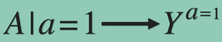

# Causal SWIGs
Single world intervention graphs.

## Backlinks
* [[§Causal inference]]
	* [[Causal SWIGs]]

<!-- #anki/deck/Causal inference# -->

Q. What does exchangeability mean in causal inference?
A. We can use a treated person’s outcome as an untreated’s counterfactual

Q. Which biases must be absent for exchangeability to hold?
A. No confounding, unbalanced effect modification, measurement bias or selection bias

Q. How can we identify exchangeability in a DAG?
A. No open backdoor paths

Q. Why can we often only examine causal effects on populations, not individuals?
A. We can’t examine the counterfactual at the individual level; we can’t go back in time.

Q. 

In causal inference, what is the meaning of the right side of the arrow?
A. The average outcome if all individuals had received treatment a = 1.

Q. 

In causal inference, what is the name of this type of graph?
A. SWIG - single world intervention graph

Q. Why might you use SWIGs instead of DAGs?
A. They make explicit which variables must be separated for exchangeability.

Q. 

What do we call this notation in causal inference?
A. Node splitting

Q. When are SWIGs preferable to DAGs?
A. In complex settings, eg. time-varying treatments

<!-- {BearID:2DACC899-5067-4182-AC36-FC0C1D58104B-972-000004847D6D407C} -->
