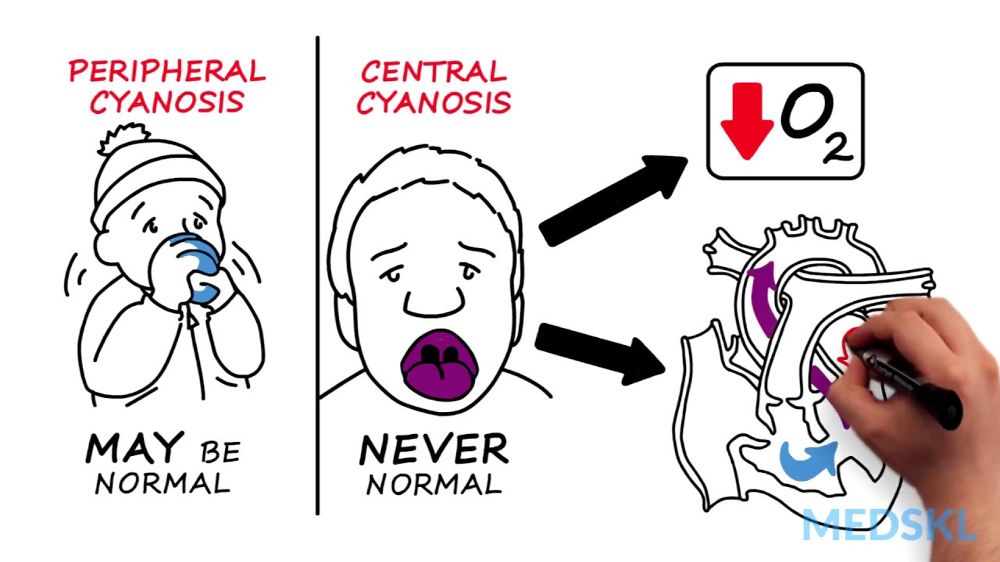

# Central cyanose
Q. Hvordan defineres central cyanose?
A. Cyanose på slimhinder

Q. Du modtager et barn med central cyanose. Hvad er den hyppigste årsag?
A. Medfødt hjertefejl

Q. Du skal til at udskrive et barn, men det har central cyanose. Hvad er næste skridt?
A. Kontakt kardiologer, OBS hjertefejl.

<!-- {BearID:6621767B-0664-4E4B-B8B8-C06B0B724C09-20485-000015F416600BCF} -->
