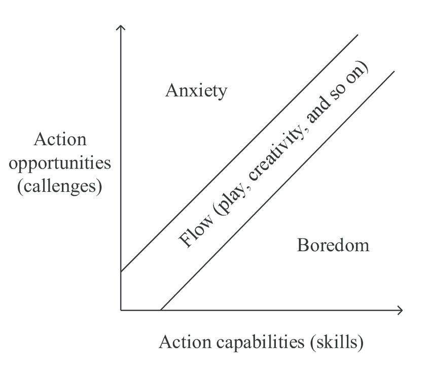

# Challenge is intrinsically motivating
Effort, then, may not have to be bad. It may even be necessary for some things to be meaningful.

Q. Which causal effects does challenge have on well-being?
A. Too much challenge undermines competence, but sufficient challenge is intrinsically motivating.

One of the reasons for [[Flow]].

## Backlinks
* [[Enjoyable usefulness]]
	* Rather, it implies that we should enjoy work when possible. Luckily, whether we apply effort and whethe we enjoy the work are probably unrelated. We can enjoy working hard while learning something new and difficult, or running a hard trail. After all, [[Challenge is intrinsically motivating]].
* [[§Intrinsic motivation]]
	* [[Challenge is intrinsically motivating]]
* [[We need challenge to enjoy life]]
	* This is one of the reasons that [[Setting goals improves well-being]], and ironically [[Challenge is intrinsically motivating]].
* [[§Difficulty]]
	* [[Challenge is intrinsically motivating]]
* [[Stress is challenge]]
	* And [[Challenge is intrinsically motivating]]. [[Difficulty can be both good and bad]].
* [[How is effort compatible with enjoyable usefulness]]
	* Luckily, activities are often enjoyable while being effortful – think gaming, running, learning something new. After all, [[Challenge is intrinsically motivating]]. 
* [[Remember second and third order effects]]
	* Since [[Challenge is intrinsically motivating]], [[We need challenge to enjoy life]]. And that means that we should [[Look for appropriate challenges]]. Now, how might we do that?

<!-- #p3 -->

<!-- {BearID:EF2212FD-817A-4127-8857-6D14326BF9EB-4433-0000033A436FA79C} -->
