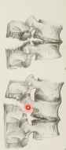

# Chance-fraktur
## Generelt
Overrivning af lig. interspinosus. med noget af overrivning af proc. spinosus.

## Differentialdiagnose

## Udredning
### Anamnese

### Objektiv us.

### Paraklinik

## Behandling

## Opfølgning

## Prognose
 

## Backlinks
* [[Denis-klassifikationen]]
	* Q. Hvad ses her?
A. En [[Chance-fraktur]]
* [[§Ryggen]]
	* [[Columnafraktur]]
	[[Chance-fraktur]]
	[[Kompressionsfraktur]]

<!-- #anki/tag/med/Orto #anki/deck/Medicine -->

<!-- {BearID:AB877B20-FAD6-438E-939A-048C2B779630-20440-000031193F7C0C35} -->
