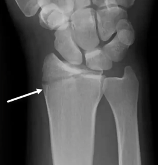

# Chauffeurs fraktur
## Generelt
Q. Hvad menes i sundhedsvæsenet med *[[Chauffeurs fraktur]]*? 
A. *Proc. styloidei radii fraktur*

Q. Hvad hedder *Proc. styloidei radii fraktur* i sundhedsvæsenet? 
A. *[[Chauffeurs fraktur]]* 

## Differentialdiagnose

## Udredning
### Anamnese

### Objektiv us.
Brug [[Watson’s test]], OBS scapholunær ligamentlæsion.

### Paraklinik
Q. Hvad ses her?

A. [[Chauffeurs fraktur]]

## Behandling
Q. Hvor hyppigt opereres [[Chauffeurs fraktur]]?
A. Altid – intraartikulær og med muskeltræk fra brachioradialis.

## Opfølgning

## Prognose
 

## Backlinks
* [[Distal radius-fraktur]]
	* Q. Hvilke [[Distal radius-fraktur]]-typer kender vi?
	* Q. Hvordan adskiller de forskellige typer [[Distal radius-fraktur]] sig fra hinanden?
* [[Chauffeurs fraktur]]
	* Q. Hvad menes i sundhedsvæsenet med *[[Chauffeurs fraktur]]*? 
	* Q. Hvad hedder *Proc. styloidei radii fraktur* i sundhedsvæsenet? 
	* Q. Hvad ses her?
A. [[Chauffeurs fraktur]]
	* Q. Hvor hyppigt opereres [[Chauffeurs fraktur]]?
* [[§Håndled]]
	* [[Distal radius-fraktur]]
	[[Smiths fraktur]]
	[[Bartons fraktur]]
	[[Chauffeurs fraktur]]

<!-- #anki/tag/med/Orto #anki/deck/Medicine -->

<!-- {BearID:9A4C057C-0C3C-4413-B23B-19C4D6AC2870-15618-00002062516B44EB} -->
