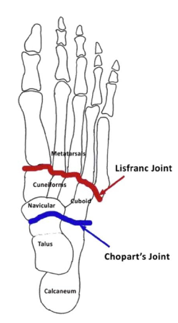

# Choparts led
Q. Hvilke knogler indgår i [[Choparts led]]?
A. 1) Os naviculare, 2) Os cuboideum, 3) Talus, 4) Calceneus

 

## Backlinks
* [[Choparts led]]
	* Q. Hvilke knogler indgår i [[Choparts led]]?

<!-- #anki/tag/med/Orto #anki/deck/Medicine -->

<!-- {BearID:8A53FB09-D5BA-48F3-8B04-8A9AEADBDF0D-22870-00006C9626DA0C70} -->
