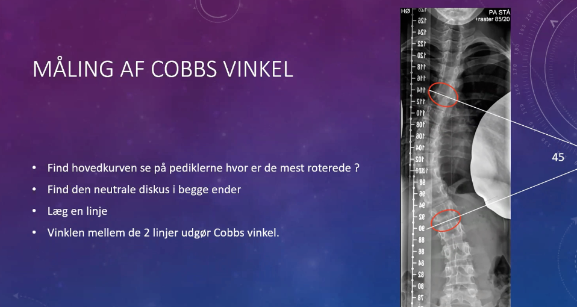

# Cobbs vinkel

Q. Hvad menes i sundhedsvæsenet med *[[Cobbs vinkel]]*? 
A. *Vinklen mellem corpora, der er roteret mest i skoliose*

Q. Hvad hedder *vinklen mellem corpora, der er roteret mest i skoliose* i sundhedsvæsenet? 
A. *[[Cobbs vinkel]]* 

*Hovedkurven* - den kurve afgrænset af corpora, der har de mindste pedikler set forfra (dermed den, der er roteret mest).

*Neutral diskus* - den diskus i kurven, der ikke har kompression over/under.

## Backlinks
* [[Cobbs vinkel]]
	* Q. Hvad menes i sundhedsvæsenet med *[[Cobbs vinkel]]*? 
	* Q. Hvad hedder *vinklen mellem corpora, der er roteret mest i skoliose* i sundhedsvæsenet? 
* [[Idiopatisk scoliose]]
	* For vinkler, [[Cobbs vinkel]].
* [[Scoliose]]
	* Q. Hvad er definitionen af [[Skoliose]]?
	* OBS [[Cobbs vinkel]]. 
	* Indikation for op:
A. 1) Svære smerter, 2) [[Cobbs vinkel]] over 50 grader, 3) Progression > 0,5-1 grad pr. år

<!-- #anki/tag/med/Orto #anki/deck/Medicine -->

<!-- {BearID:95D4F07F-9708-4973-A142-680C991BEFA4-2650-00000573E10EAEF1} -->
