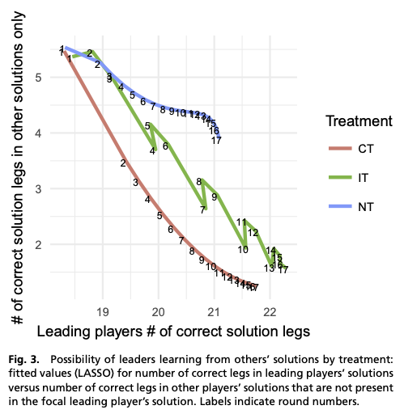

# Collaboration speeds up problem solving
Since we can build on each others solutions and each devote time, quickly climbing the hill to a local optimum.

However, if you are one of the quicker ones, you will climb more slowly to the local optimum.

See also figure 3 of [[Bernstein 2018]].

Numbers on graph are number of rounds. After eg. the second round, CT (constant teamwork) significantly outperforms the other areas on # of correct solution legs.

## Backlinks
* [[Establish a causal model]]
	* It is almost always a good idea to first [[Do your own thinking]], and if afterwards it is indicated, to research what others believe ([[Balance researching and thinking for causal models]], [[Collaboration speeds up problem solving]]).
* [[Ability to reload a solution decreases maximum quality of solutions]]
	* From [[Bernstein 2018]], shows that if we’re looking to find the optimum solution, ability to refer to previous solutions is not necessarily a good idea. However, in real-world scenarios we often want to [[Increase reusability]] because the solutions we have are adequate. Furthermore, speed is often way more important than finding the optimal solution – eg. producing a computer is way more important than finding the best way of producing a computer. Collaboration and storage work way better for speed, [[Collaboration speeds up problem solving]].
* [[§Collaboration]]
	* [[Collaboration speeds up problem solving]]
* [[Problem solving in teams]]
	* [[Collaborative problem solving increases average solution quality]]
[[Collaborative increases number of problem types that can be solved]]
* [[Should I ask for help very early in the problem solving process?]]
	* Given that [[Collaboration speeds up problem solving]], and the graph, should I ask for help as early in the problem solving process as possible?

<!-- {BearID:B610B49A-9CA2-4948-8419-E8C706BE419C-32756-0000333B0A5AC168} -->
