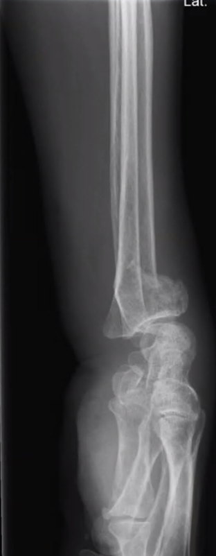
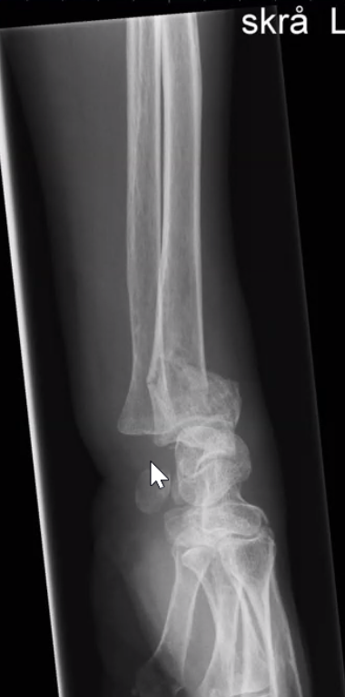
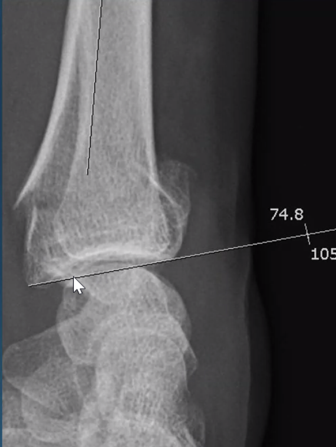

# Colles fraktur
## Generelt
https://www.auh.dk/siteassets/afdelinger/falles-akut-afdeling/skadestuen/kompendium/handledhand/auh-skadestue-distalradiusfraktur-colles-voksne-17-03-2021.pdf

## Differentialdiagnose

## Udredning
### Anamnese

### Objektiv us.

### Paraklinik
Q. Hvad ses her?

A. [[Colles fraktur]]

Q. Hvad ses her?

A. [[Colles fraktur]]

## Behandling

Se [[Distal radius-fraktur]].

## Opfølgning

## Prognose
 

## Backlinks
* [[Distal radius-fraktur]]
	* Q. Hvilke [[Distal radius-fraktur]]-typer kender vi?
	* Q. Hvordan adskiller de forskellige typer [[Distal radius-fraktur]] sig fra hinanden?
* [[Colles fraktur]]
	* Q. Hvad ses her?
A. [[Colles fraktur]]
	* Q. Hvad ses her?
A. [[Colles fraktur]]
* [[§Håndled]]
	* [[Distal radius-fraktur]]
	[[Smiths fraktur]]
	[[Bartons fraktur]]
	[[Chauffeurs fraktur]]

<!-- #anki/tag/med/Orto #anki/deck/Medicine -->

<!-- {BearID:1928E99A-F9F0-4916-AF3E-A1594979E331-80814-00012104590C8427} -->
