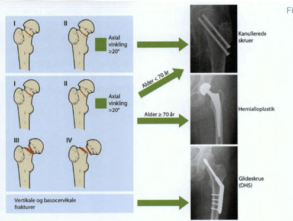

# Collum femoris fraktur
## Generelt
Q. Hvilke typer [[Collum femoris fraktur]] er dislocerede?
A. Garden type 3 og 4

Q. Hvordan adskiller Garden type 3-4 [[Collum femoris fraktur]] sig fra type 1-2?
A. De er dislocerede

Q. Hvad hedder graderingssystemet for [[Collum femoris fraktur]]?
A. Gardens typer

3-4 alloplastik pga. risiko for caputnekrose.

## Differentialdiagnose

## Udredning
### Anamnese

### Objektiv us.

### Paraklinik

## Behandling

Q. Hvilke typer [[Collum femoris fraktur]] behandles?
A. Alle

Q. Hvordan opererer vi [[Collum femoris fraktur]]?
A. Garden type 1-2: Skruer eller glideskrue. 3-4: Total alloplastik. 

Som generelt, hvis osteoporose eller gigt: protese. Hvis gigt, total alloplastik. Ellers hemialloplastik. Resten får 1) 3-4 skruer eller 2) Glideskrue.

Q. Hvilke risici ses især ved behandling af [[Collum femoris fraktur]] med hemialloplastik?
A. 1) Luksation, 2) Nedslidning af brusk, 3) Periprotetisk fraktur, 4) Proteseløsning

## Opfølgning

## Prognose
 
## Backlinks
* [[Collum femoris fraktur]]
	* Q. Hvilke typer [[Collum femoris fraktur]] er dislocerede?

	* Q. Hvordan adskiller Garden type 3-4 [[Collum femoris fraktur]] sig fra type 1-2?

	* Q. Hvad hedder graderingssystemet for [[Collum femoris fraktur]]?
	* Q. Hvilke typer [[Collum femoris fraktur]] behandles?
	* Q. Hvordan opererer vi [[Collum femoris fraktur]]?
	* Q. Hvilke risici ses især ved behandling af [[Collum femoris fraktur]] med hemialloplastik?
* [[§Hofte]]
	* [[Proksimal femurfraktur]]
	[[Pertrokantær femurfraktur]]
	[[Subtrokantær femurfraktur]]
* [[Undersøgelse af hofte]]
	* Q. Din patient har hoftesmerter. Hvad vil du palpere ved [[Undersøgelse af hofte]]?
* [[Proksimal femurfraktur]]
	* Q. Hvordan kategoriseres en [[Proksimal femur-fraktur]]?

<!-- #anki/tag/med/Orto #anki/deck/Medicine -->

<!-- {BearID:8AB0B1D8-EA2B-4C9F-AC6C-E659114F0B16-53319-00006FBADE1B15B3} -->
