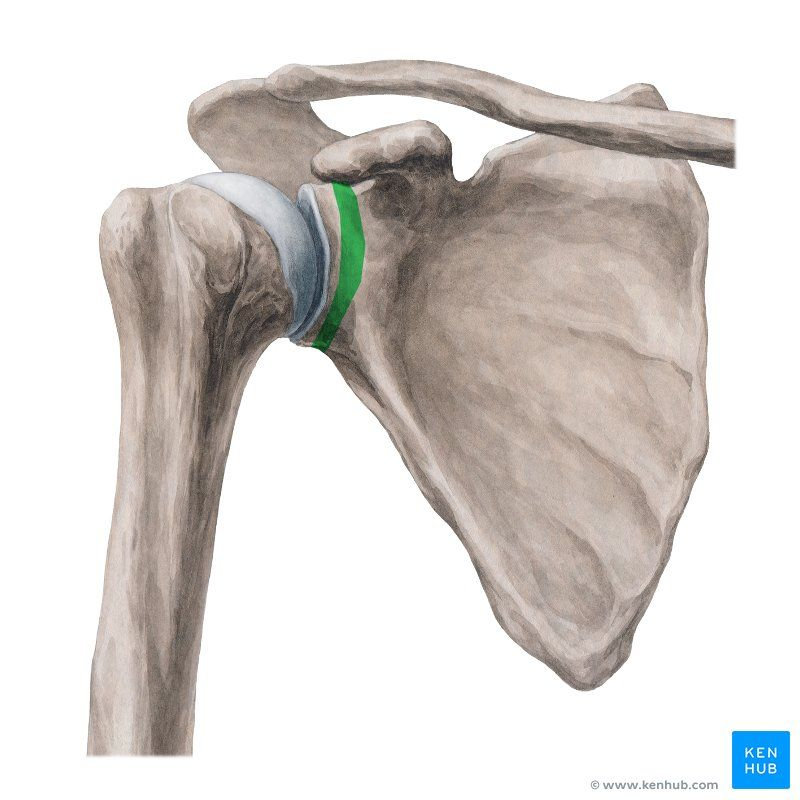

# Collum scapula-fraktur

Q. Hvordan er prognosen for opheling af [[Collum scapula-fraktur]]? 
A. Opheler typisk medialstillet og fejlroteret -> Nedsat bevægelse og funktion.

## Backlinks
* [[Collum scapula-fraktur]]
	* Q. Hvordan er prognosen for opheling af [[Collum scapula-fraktur]]? 
* [[Scapulafraktur]]
	* Q. Hvordan opdeles [[Scapulafraktur]]?

<!-- #anki/tag/med/Orto #anki/deck/Medicine -->

<!-- {BearID:B9F83925-4BE2-4A5F-AF5A-86F3D42CC758-76574-00009ABD140170F5} -->
