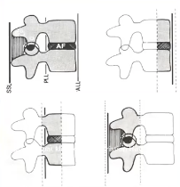

# Columnafraktur
## Generelt
[[Denis-klassifikationen]]

Q. Din patient har været i et trafikuheld, og du mistænker [[Columnafraktur]]. Hvor i columna ses disse hyppigtst?
A. 1) Cervicalcolumna (40%), 2) Thoracalcolumna (40%)

Q. Din patient har været i et trafikuheld, og du mistænker [[Cervikal tværsnitslæsion]]. Rtg. normal. Hvad nu?
A. 1) Bestil MR, 9% er rtg. normale.

Q. Hvor ses hyppigst traumatiske neurologiske udfald i ryggen?
A. Cervikalcolumna, ca. 50% af disse har det mod ca. 7% i thoracalcolumna.

## Differentialdiagnose

## Udredning
### Anamnese

### Objektiv us.

### Paraklinik

## Behandling

## Opfølgning

## Prognose
 

## Backlinks
* [[Columnafraktur]]
	* Q. Din patient har været i et trafikuheld, og du mistænker [[Columnafraktur]]. Hvor i columna ses disse hyppigtst?
* [[Denis-klassifikationen]]
	* Q. Hvilket system bruges i sundhedsvæsenet til klassifikation af *[[Columnafraktur]]*? 
	* Q. Hvad bruges *[[Denis-klassifikationen]]* til i sundhedsvæsenet? 
	* Q. Beskriv klassifikationen af *[[Columnafraktur]]* i sundhedsvæsenet. 

* [[§Ryggen]]
	* [[Columnafraktur]]
	[[Chance-fraktur]]
	[[Kompressionsfraktur]]

<!-- #anki/tag/med/Orto #anki/deck/Medicine #anki/tag/med/Neurology -->

<!-- {BearID:1DFEDB35-E3C8-425E-BCE7-ABFF95B8F43F-4231-000018AE054F88DD} -->
