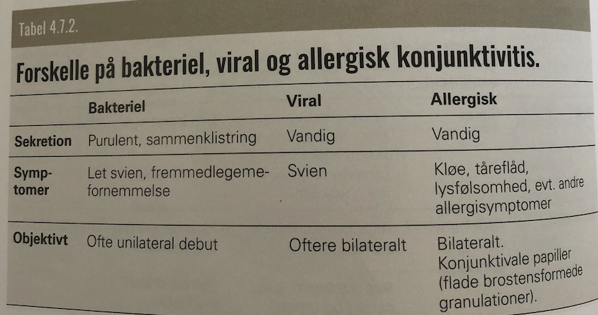

# Conjunctivitis 
# Conjunctivitis 
# Conjunctivitis 
# Conjunctivitis 
# Conjunctivitis 
# Conjunctivitis 

[[Bakteriel conjunktivitis]]
[[Viral conjunktivitis]]
[[Allergisk conjunktivitis]]

## Backlinks
* [[Chlamydia]]
	* [[Conjunctivitis]]
* [[Rosacea]]
	* Q. Beskriv SOCR *A* TES for [[Rosacea]] 
* [[Gonorre]]
	* [[Conjunctivitis]]
* [[Det røde øje]]
	* Klart hyppigst [[Conjunctivitis]]. 
	* Q. Hvad er de primære differentialdiagnoser til [[Det røde øje]]?
* [[Reiters syndrom]]
	* [[Reaktiv artrit]]
[[Conjunctivitis]]/[[Irit]]
Slimhinde og hudlæsioner

<!-- #anki/tag/med/Ophthalmology #anki/deck/Medicine -->

<!-- {BearID:ACAA9271-FDA6-4BC2-9C39-68BA9EACDF5C-97624-0000B3E9BF2FA11B} -->
