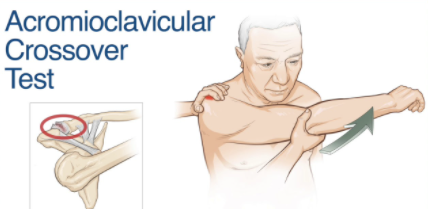

# Crossover test
## Generelt
Q. Beskriv en *[[Crossover test]]*.
A. Skulderled 90 grader flekteret, føres ind foran kroppen.

Q. Hvad tester en *[[Crossover test]]* for?
A. *[[Acromiocalviculær artrose]]*

Q. Hvilken test kan bruges til at teste for *[[Acromiocalviculær artrose]]*?
A. *[[Crossover test]]*

Q. Hvad er et abnormt resultat af en *[[Crossover test]]*?
A. Smerter

## Backlinks
* [[Crossover test]]
	* Q. Beskriv en *[[Crossover test]]*.

	* Q. Hvad tester en *[[Crossover test]]* for?
	* Q. Hvilken test kan bruges til at teste for *[[Acromiocalviculær artrose]]*?
	* Q. Hvad er et abnormt resultat af en *[[Crossover test]]*?
* [[Undersøgelse af skulder]]
	* [[Crossover test]]
* [[Acromioclaviculær artrose]]
	* [[Crossover test]]
* [[Us. af skulder]]
	* Normal liftoff (lag-sign). Neg. [[Crossover test]].

<!-- #anki/tag/med/Orto #anki/deck/Medicine -->

<!-- {BearID:798FDAD5-4AD8-4628-A234-5E2ED2D51230-51703-00006B08F455B37C} -->
