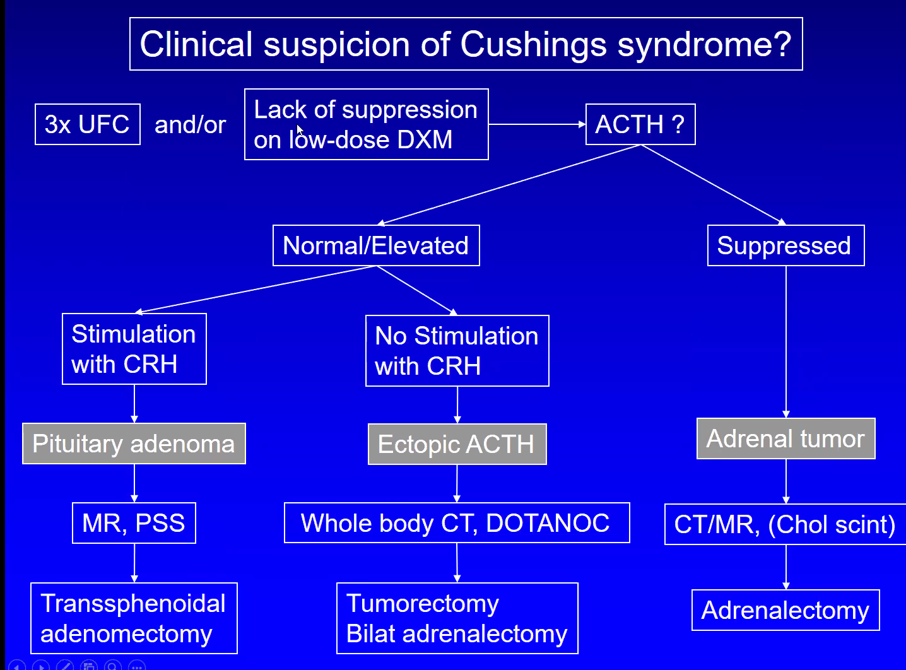

# Cushing’s syndrom
Kan forårsages enten [[ACTH]]-afhængigt eller ACTH-uafhængigt. [[Hypercortisolæmi]]. Med samme kliniske billede findes [[Pseudo-Cushing’s]]

## Generelt
Q. Hvordan kategoriseres årsagerne til [[Cushing’s syndrom]] biokemisk?
A. ACTH-afhængigt eller -uafhængig

Q. Hvilke ACTH-uafhængige årsager findes der til [[Cushing’s syndrom]]?
A. 1) Iatrogent, 2) Cortisol-producerende tumores ([[Binyrebarkadenom]], [[Binyrebark-carcinom]])

Q. Hvilke ACTH-afhængige årsager findes der til [[Cushing’s syndrom]]?
A. 1) [[Hypofyseadenom]], 2) Ektopisk tumor, eg. [[Lungecancer]]

Q. Hvad skyldes [[Cushing’s syndrom]]?
A. For meget [[Glucokortikoid]]

## Differentialdiagnose

## Udredning
### Anamnese

### Objektiv us.
Q. Hvilke objektive fund tyder på [[Cushing’s syndrom]]?
A. 1) Moon-face, 2) Buffalo-hump, 3) Atrofi af proksimal muskulatur, 5) Striationer på hud, 6) Blå mærker

### Paraklinik
Q. Hvilke parakliniske fund tyder på [[Cushing’s syndrom]]?
A. [[Hypertension]], [[Osteoporose]]

## Behandling

## Opfølgning

## Prognose

# Symptomer og kliniske fund

Q. Hvorfor vil [[Cushing’s syndrom]] indeholde [[Hypertension]]?
A. [[Glucokortikoid]] har delvis effekt som [[Mineralocortikoid]].

Q. Hvilke akutte biokemiske tilstande kan være tegn på [[Cushing’s syndrom]]?
A. 1) [[Hypokaliæmi]], 2) [[Hyperglykæmi]]

Q. Hvilke symptomer tyder på [[Cushing’s syndrom]]?
A. 1) Psykiske forandringer (depression, mani, psykose), 2) Føler sig muskelsvag, 3) Seksuel dysfunktion

# Diagnose

Q. Hvordan adskiller man diagnostisk 1) [[ACTH]]-producerende hypofyseadenomer fra 2) ektopiske tumorer?
A. [[CRH]]. Medfører [[ACTH]]-sekretion fra [[Hypofyseadenom]], ikke fra ektopiske.

[[Sinus petrosus inferior kateterisation]] vil her være for invasiv, hvis man ikke har prøvet ovenstående to først.

Q. En 35-årig patient har vægtforøgelse, men tab af muskelmasse. Hvad tænker du?
A. [[Cushing’s syndrom]].

Q. En patient har [[Cushing’s syndrom]] og høj [[ACTH]]. [[CRH]] kan stimulere [[ACTH]]-sekretion. [[ACTH]] stadig høj. Hvad nu?
A. [[MR]] hypofysen, hvis neg. [[Sinus petrosus inferior kateterisation]]. Hvis stadig neg. udred, ektopisk tumor.

Q. Hvordan diagnosticeres om der er tale om [[Cushing’s syndrom]]?
A. 1) Døgn-urin [[Cortisol]]

Q. Hvordan skelnes mellem [[ACTH]]-afhængigt og -uafhængigt [[Cushing’s syndrom]]?
A. *p-ACTH*

Q. En patient har [[Cushing’s syndrom]]. p-[[ACTH]] er normal. Hvad tyder det på?
A. [[ACTH]]-afhængig årsag, eg. [[Hypofyseadenom]] eller ektopisk tumor

Q. Hvordan udredes [[ACTH]]-*afhængigt* [[Cushing’s syndrom]]?
A. MR af [[§Hypofysen]], CT af *thorax*.
Hvorfor thorax? [[Lungecancer]].

Q. Hvordan udredes [[ACTH]]-*uafhængigt* [[Cushing’s syndrom]]?
A. *CT-TAB* (OBS: binyretumor).
Altså tilføjelse af bækken ift. den ACTH-uafhængige.

## Backlinks
* [[ACTH]]
	* Q. Hvilken sygdom leder *hyper*sekretion af [[ACTH]] til? 
* [[Cushing’s syndrom]]
	* Q. Hvordan kategoriseres årsagerne til [[Cushing’s syndrom]] biokemisk?
	* Q. Hvilke ACTH-uafhængige årsager findes der til [[Cushing’s syndrom]]?
	* Q. Hvilke ACTH-afhængige årsager findes der til [[Cushing’s syndrom]]?
	* Q. Hvad skyldes [[Cushing’s syndrom]]?
	* Q. Hvilke objektive fund tyder på [[Cushing’s syndrom]]?
	* Q. Hvilke parakliniske fund tyder på [[Cushing’s syndrom]]?
	* Q. Hvorfor vil [[Cushing’s syndrom]] indeholde [[Hypertension]]?
	* Q. Hvilke akutte biokemiske tilstande kan være tegn på [[Cushing’s syndrom]]?
	* Q. Hvilke symptomer tyder på [[Cushing’s syndrom]]?
	* Q. En 35-årig patient har vægtforøgelse, men tab af muskelmasse. Hvad tænker du?
	* Q. En patient har [[Cushing’s syndrom]] og høj [[ACTH]]. [[CRH]] kan stimulere [[ACTH]]-sekretion. [[ACTH]] stadig høj. Hvad nu?
	* Q. Hvordan diagnosticeres om der er tale om [[Cushing’s syndrom]]?
	* Q. Hvordan skelnes mellem [[ACTH]]-afhængigt og -uafhængigt [[Cushing’s syndrom]]?
	* Q. En patient har [[Cushing’s syndrom]]. p-[[ACTH]] er normal. Hvad tyder det på?
	* Q. Hvordan udredes [[ACTH]]-*afhængigt* [[Cushing’s syndrom]]?
Hvorfor thorax? [[Lungecancer]].
	* Q. Hvordan udredes [[ACTH]]-*uafhængigt* [[Cushing’s syndrom]]?
Altså tilføjelse af bækken ift. den ACTH-uafhængige.
* [[Cushing’s sygdom]]
	* En af årsagerne til [[Cushing’s syndrom]]. Symptomerne er de samme som ved [[Cushing’s syndrom]].
	* En af årsagerne til [[Cushing’s syndrom]]. Symptomerne er de samme som ved [[Cushing’s syndrom]].
* [[Cortisol]]
	* Hvis for meget ses [[Cushing’s syndrom]] pga. [[Hypercortisolæmi]].
	* Q. Hvilken sygdom leder *hyper*sekretion af [[Cortisol]] til? 
* [[Træthed]]
	* [[Polymyalgia rheumatica]]
[[Cushing’s syndrom]]
[[Binyrebarkinsufficiens]]
* [[PCOS]]
	* [[Akromegali]], [[Hyperprolaktinæmi]],  [[Hyperthyreose (for udredning, se Thyrotoxikose)]], [[Hyperthyreose (for udredning, se Thyrotoxikose)]], [[Cushing’s syndrom]], [[Primær hypogonadisme]]

<!-- #anki/tag/med/Endocrinology #anki/deck/Medicine -->

<!-- {BearID:9A602BE7-A8BB-490B-93DA-1E0384006BD2-966-000016239DB3E28F} -->
