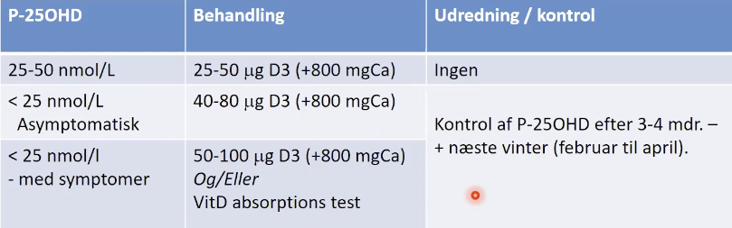

# D-vitaminmangel
Mangel på [[D-vitamin]].

For grænser, se https://www.sundhed.dk/sundhedsfaglig/laegehaandbogen/endokrinologi/tilstande-og-sygdomme/knoglevaev-og-vitamin-d/d-vitamin-mangel/.

Q. En patient har svær [[D-vitaminmangel]]. Hvad er den initielle behandling?
A. 50-100 mikrogram dgl.

Q. Din patient opstartes i behandling for [[D-vitaminmangel]]. Hvad nu?
A. Nedsæt dosis til 35 mikrogram dgl. efter 6 mdr.

Q. Hvor hurtigt forventes at ses effekt ved substitution ved [[D-vitaminmangel]]?
A. 3 mdr.

Ikke kontrol før, lang halveringstid.

## Backlinks
* [[D-vitaminmangel]]
	* Q. En patient har svær [[D-vitaminmangel]]. Hvad er den initielle behandling?
	* Q. Din patient opstartes i behandling for [[D-vitaminmangel]]. Hvad nu?
	* Q. Hvor hurtigt forventes at ses effekt ved substitution ved [[D-vitaminmangel]]?
* [[Sekundær hyperparathyroidisme]]
	* Q. Hvordan behandles sekundær og [[Tertiær hyperparathyroidisme]]?
* [[Træthed]]
	* *E*
[[Hyperparathyroidisme]]
[[Type 2 diabetes]]
[[D-vitaminmangel]]
* [[Hyperparathyroidisme]]
	* Q. Beskriv den ætiologiske forskel på primær, sekundær og tertiær [[Hyperparathyroidisme]].
* [[Myalgi]]
	* [[D-vitaminmangel]]

<!-- #anki/tag/med/gp #anki/deck/Medicine -->

<!-- {BearID:68A35E69-A112-4BE3-B85E-89A48F715A66-43570-00005A0EE0F7AC14} -->
