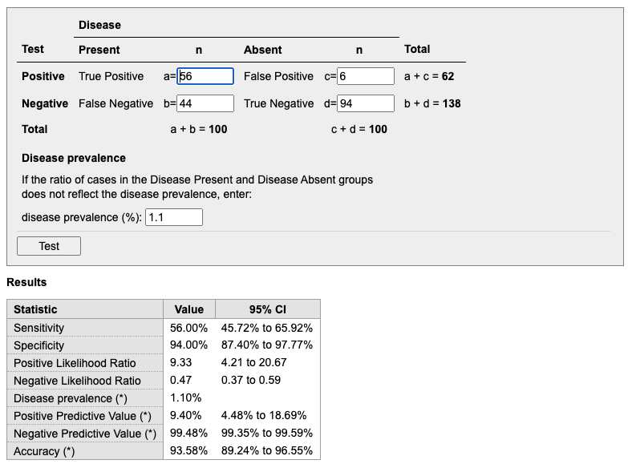

# Danielsen, Predicting mechanical restraint of psychiatric inpatients by applying machine learning on electronic health data
Whether incident MR occurring in the first 3 days following admission could be predicted based on analysis of electronic health data available after the first hour of admission.

Ref 20-22, suicide, domestic abuse, and treatment response
	Looks like they required manual extraction?

Populationen har aldrig tidligere haft MR, så har ikke tårnhøj risiko til at starte med.

Compare with Brøset Violence Index!

> At 94% speci- ficity, the sensitivity was 56% and PPV was 8.1%; at 88% specificity, the sensitivity was 74% and PPV was 6.0%.

Det matcher ikke med det jeg får, udfra en prævalens på 1.1%: 

> The case definition (MR in the 71-h period between one hour after admission and 3 days after admission) was met by 100 (1.1%) of the included admissions

<!-- {BearID:343C1421-8721-43F9-B470-6CFB54D07183-4241-0000032F1B0664FC} -->
