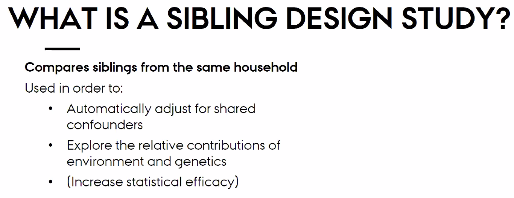
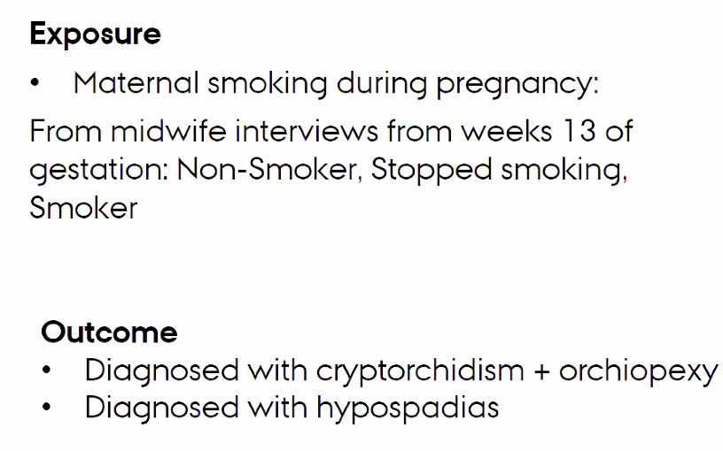
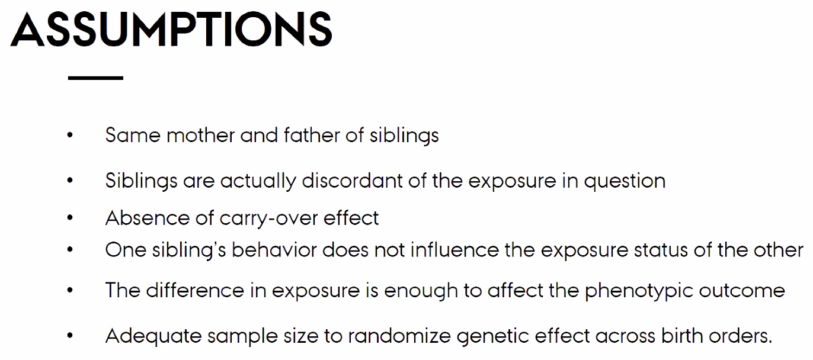
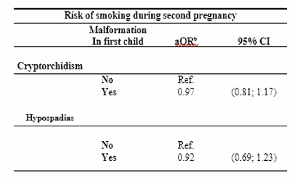

# Daniel’s presentation

Sibling designs adjust for shared factors – eg. If you’re examining the effect of diet, it is not a good choice.

Misclassification may carry-over (eg. If the first child gets a birth-defect, she may be more likely to lie at the second effect).

Carry-over, width of confidence intervals is high:

<!-- {BearID:C409BF93-9B54-40F3-B829-D5F12C7A600E-11150-00001A82FDDFBE5C} -->
